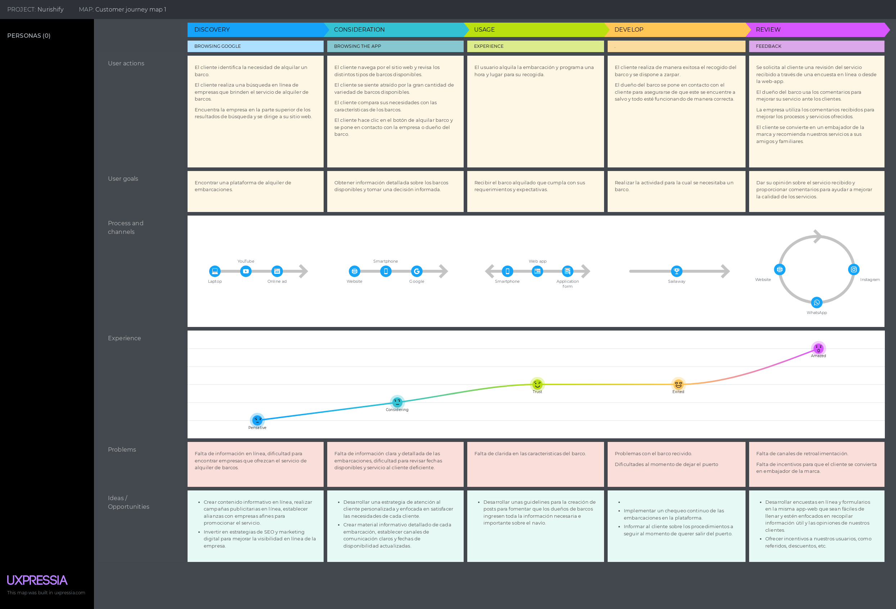
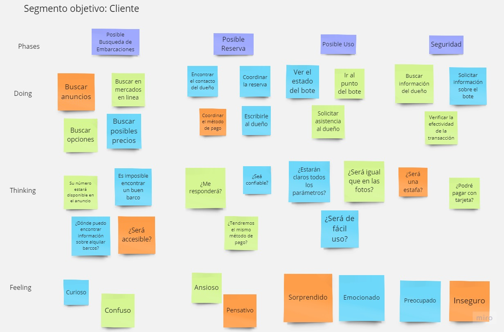
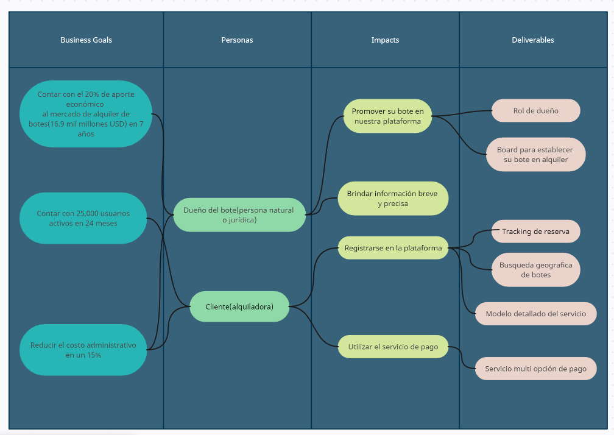
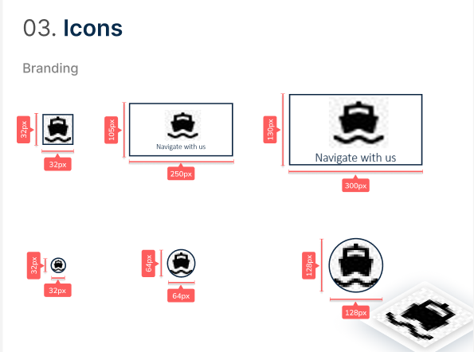
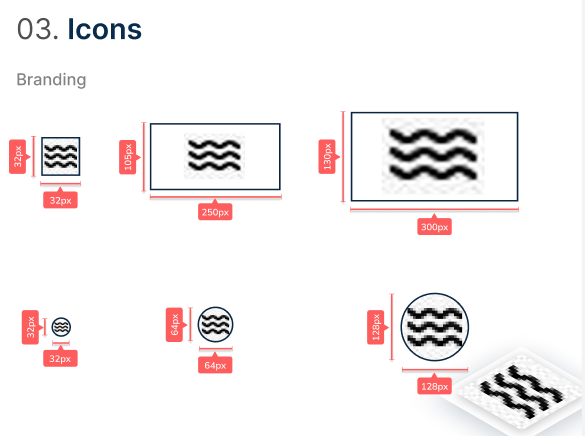
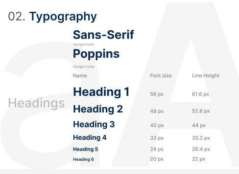
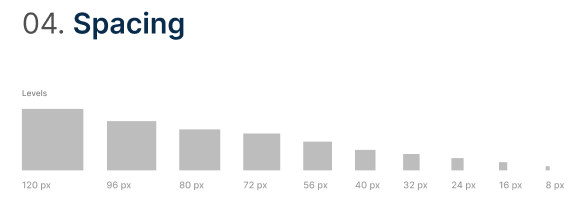
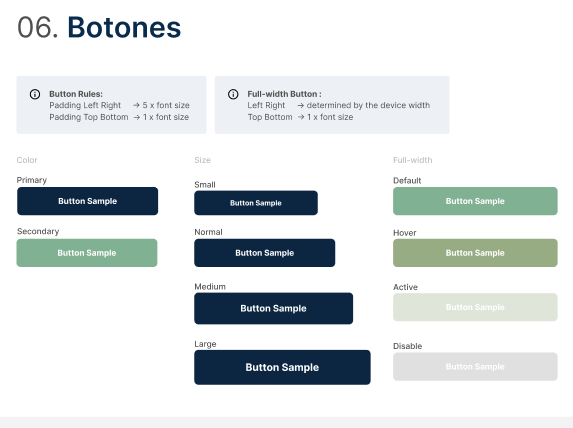
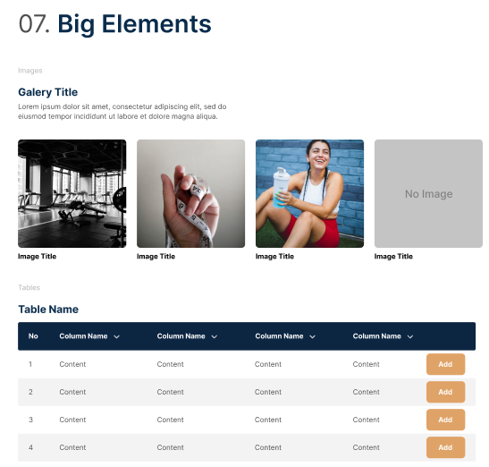

   

<h1 align="center">Universidad Peruana de Ciencias Aplicadas</h1>

<h2 align="center">Ingeniería de Software</h2>

<h3>Aplicaciones Open Source - TB1</h3>

**Sección:** SW51  
**Docente:** Angel Augusto Velasquez Nuñez  
**Ciclo:** 2023-02  
**Nombre de la Startup:** TechTeam  
**Nombre del producto:** Swift Ship  

<h3>Integrantes</h3>

| Alumnos                          |   Codigo   |
| :------------------------------- | :--------: |
| Adrian Gonzalo Melgar Takahashi  | U201819465 |
| Lorenzo Sebastian Navarro Robles | U201713141 |
| Sebastian Alonso Bustinza Muñoz  | U202123362 |
| Gianfranco Luna Morales          | U201824343 |

<strong>Organización GitHub: </strong> <a href="https://github.com/upc-ws51-techteam" target="_blank">Tech-Team-Swift-Ship</a>

 

<h1 align="center">Registro de versiones</h1>

 
<table>
        <thead>
            <tr>
                <th>Versión</th>
                <th>Fecha</th>
                <th>Autor</th>
                <th>Descripción de modificaciones</th>
            </tr>
        </thead>
        <tbody>
            <tr>
                <td>1.0</td>
                <td>07/09/2023</td>
                <td>Navarro, Lorenzo Melgar, Adrian Luna, Gianfranco Bustinza, Sebastian </td>
                <td>Entrega de la primera versión del trabajo parcial de Aplicaciones Web: Landing Page.</td>
            </tr>
        </tbody>
    </table>

 

<h1 align="center">Swift Ship</h1>
 

<ul style="list-style-type: none;">
   <li><h1><a href="#capitulo-1">Capítulo I: Introducción</a></h1></li>
   <li><h3><a href="#startup-profile">1.1. Startup Profile</a></h3></li>
   <ul>
      <li><h3><a href="#descripcion-startup">1.1.1.  Descripción de la Startup</a></h3></li>
      <li><h3><a href="#perfiles-integrantes">1.1.2. Perfiles de integrantes del equipo</a></h2></li>
   </ul>
   <li><h3><a href="#solution-profile">1.2. Solution Profile</a></h3></li>
   <ul>
      <il><h3><a href="#antecedentes-y-problematica">1.2.1 Antecedentes y problemática</a></h3></il>
      <il><h3><a href="#lean-ux-process">1.2.2 Lean UX Process</a></h3></il>
      <ul>
         <il><h3><a href="#lean-ux-problem-statements">1.2.2.1. Lean UX Problem Statements</a></h3></il>
         <il><h3><a href="#lean-ux-assumptions">1.2.2.2. Lean UX Assumptions</a></h3></il>
         <il><h3><a href="#lean-ux-hypothesis-statement">1.2.2.3. Lean UX Hypothesis Statements</a></h3></il>
         <il><h3><a href="#lean-ux-canvas">1.2.2.4. Lean UX Canvas</a></h3></il>
      </ul>
   </ul>
   <il><h3><a href="#segmento-objetico">1.3. Segmentos objetivo</a></h3></il>

<il><h1><a href="#capitulo-2">Capítulo II: Requirements Elicitation & Analysis</a></h1></il>
<il><h3><a href="#competidores">2.1. Competidores</a></h3></il>

   <ul>
      <il><h3><a href="#analisis-competitivo">2.1.1. Análisis competitivo</a></h3></il>
      <il><h3><a href="#estrategias-y-tacticas-frente-a-competidores">2.1.2. Estrategias y tácticas frente a competidores</a></h3></il>
   </ul>
<il><h3><a href="#entrevistas">2.2. Entrevistas</a></h3></il>
   <ul>
      <il><h3><a href="#diseño-de-entrevistas">2.2.1. Diseño de entrevistas</a></h3></il>
      <il><h3><a href="#registro-de-entrevistas">2.2.2. Registro de entrevistas</a></h3></il>
      <il><h3><a href="#analisis-de-entrevistas">2.2.3. Análisis de entrevistas</a></h3></il>
   </ul>
<il><h3><a href="#needfinding">2.3. Needfinding</a></h3></il>
   <ul>
      <il><h3><a href="#user-personas">2.3.1. User Personas</a></h3></il>
      <il><h3><a href="#user-task-matrix">2.3.2. User Task Matrix</a></h3></il>
      <il><h3><a href="#user-journey-mapping">2.3.3. User Journey Mapping</a></h3></il>
      <il><h3><a href="#empathy-mapping">2.3.4. Empathy Mapping</a></h3></il>
      <il><h3><a href="#as-is">2.3.5. As-is Scenario Mapping</a></h3></il>
   </ul>

<il><h1><a href="#capitulo-3">Capítulo III: Requirements Specification</a></h1></il>
<il><h3><a href="#to-be">3.1. To-Be Scenario Mapping</a></h3></il>
<il><h3><a href="#user-stories">3.2. User Stories</a></h3></il>
<il><h3><a href="#impact-mapping">3.3. Impact Mapping</a></h3></il>
<il><h3><a href="#product-backlog">3.4. Product Backlog</a></h3></il>

<il><h1><a href="#capitulo-4">Capítulo IV: Product Design</a></h1></il>
<il><h3><a href="#style-guidelines">4.1. Style Guidelines</a></h3></il>

   <ul>
      <il><h3><a href="#general-style-guidelines">4.1.1. General Style Guidelines</a></h3></il>
      <il><h3><a href="#web-style-guidelines">4.1.2. Web Style Guidelines</a></h3></il>
   </ul>
<il><h3><a href="#information-architecture">4.2. Information Architecture</a></h3></il>
   <ul>
      <il><h3><a href="#organization-systems">4.2.1. Organization Systems</a></h3></il>
      <il><h3><a href="#labeling-systems">4.2.2. Labeling Systems</a></h3></il>
      <il><h3><a href="#meta-tags">4.2.3. SEO Tags and Meta Tags</a></h3></il>
      <il><h3><a href="#searching-systems">4.2.4. Searching Systems</a></h3></il>
      <il><h3><a href="#navigation-systems">4.2.5. Navigation Systems</a></h3></il>
   </ul>
<il><h3><a href="#landing-page-ui-design">4.3. Landing Page UI Design</a></h3></il>
   <ul>
      <il><h3><a href="#landing-page-wireframe">4.3.1. Landing Page Wireframe</a></h3></il>
      <il><h3><a href="#landingpage-mock-up">4.3.2. Landing Page Mock-up</a></h3></il>
   </ul>
<il><h3><a href="#web-applications-ux-ui-design">4.4. Web Applications UX/UI Design</a></h3></il>
   <ul>
      <il><h3><a href="#web-applications-wireframes">4.4.1. Web Applications Wireframes</a></h3></il>
      <il><h3><a href="#web-applications-wireflow-diagrams">4.4.2. Web Applications Wireflow Diagrams</a></h3></il>
      <il><h3><a href="#web-applications-mock-ups">4.4.3. Web Applications Mock-ups</a></h3></il>
      <il><h3><a href="#web-applications-user-flow-diagrams">4.4.4. Web Applications User Flow Diagrams</a></h3></il>
   </ul>
<il><h3><a href="#web-applications-prototyping">4.5. Web Applications Prototyping</a></h3></il>
<il><h3><a href="#domain-driven-software-architecture">4.6. Domain-Driven Software Architecture</a></h3></il>
   <ul>
      <il><h3><a href="#software-architecture-context-diagram">4.6.1. Software Architecture Context Diagram</a></h3></il>
      <il><h3><a href="#software-architecture-container-diagrams">4.6.2. Software Architecture Container Diagrams</a></h3></il>
      <il><h3><a href="#software-architecture-components-diagrams">4.6.3. Software Architecture Components Diagrams</a></h3></il>
   </ul>
<il><h3><a href="#software-object-oriented-design">4.7. Software Object-Oriented Design</a></h3></il>
   <ul>
      <il><h3><a href="#class-diagrams">4.7.1. Class Diagrams</a></h3></il>
      <il><h3><a href="#class-dictionary">4.7.2. Class Dictionary</a></h3></il>
   </ul>
<il><h3><a href="#database-design">4.8. Database Design</a></h3></il>
   <ul>
      <il><h3><a href="#database-diagram">4.8.1. Database Diagram</a></h3></il>
   </ul>

<il><h1><a href="#capitulo-5">Capítulo V: Product Implementation, Validation & Deployment</a></h1></il>
<il><h3><a href="#software-configuration-management">5.1. Software Configuration Management</a></h3></il>

   <ul>
      <il><h3><a href="#software-development-environment-configuration">5.1.1. Software Development Environment Configuration</a></h3></il>
      <il><h3><a href="#source-code-management">5.1.2. Source Code Management</a></h3></il>
      <il><h3><a href="#source-code-style-guide-&-conventions">5.1.3. Source Code Style Guide & Conventions</a></h3></il>
      <il><h3><a href="#software-deployment-configuration">5.1.4. Software Deployment Configuration</a></h3></il>
   </ul>
<il><h3><a href="#landing-page-services-&-applications-implementation">5.2. Landing Page, Services & Applications Implementation</a></h3></il>
   <ul>
      <il><h3><a href="#sprint-1">5.2.1. Sprint 1</a></h3></il>
      <ul>
         <il><h3><a href="#sprint-planning-1">5.2.1.1. Sprint Planning 1</a></h3></il>
         <il><h3><a href="#sprint-backlog-1">5.2.1.2. Sprint Backlog 1</a></h3></il>
         <il><h3><a href="#development-evidence-for-sprint-review">5.2.1.3. Development Evidence for Sprint Review</a></h3></il>
         <il><h3><a href="#testing-suite-rvidence-for-sprint-review">5.2.1.4. Testing Suite Evidence for Sprint Review</a></h3></il>
         <il><h3><a href="#execution-evidence-for-sprint-review">5.2.1.5. Execution Evidence for Sprint Review</a></h3></il>
         <il><h3><a href="#services-documentation-evidence-for-sprint-review">5.2.1.6. Services Documentation Evidence for Sprint Review</a></h3></il>
         <il><h3><a href="#software-deployment-evidence-for-sprint-review">5.2.1.7. Software Deployment Evidence for Sprint Review</a></h3></il>
         <il><h3><a href="#team-collaboration-insights-during-sprint">5.2.1.8. Team Collaboration Insights during Sprint</a></h3></il>
      </ul>
   </ul>
</ul>

 
 

# Student Outcome

## ABET – EAC - Student Outcome 3

   <table>
      <thead>
         <tr>
            <th style="text-align: center;">Criterio específico</th>
            <th style="text-align: center;">Acciones realizadas</th>
            <th style="text-align: center;">Conclusiones</th>
         </tr>
      </thead>
      <tbody>
         <tr>
            <td rowspan="6" style="text-align: justify;">Capacidad de comunicarse efectivamente con un rango de audiencias</td>
         </tr>
         <tr>
            <td><strong>Adrian Gonzalo Melgar Takahashi TB1:</strong> En el contexto de esta entrega, he estado plenamente involucrado y he compartido de forma proactiva mis progresos en la redacción del proyecto. Asimismo, se llevaron a cabo diversas reuniones para intercambiar ideas y asignar las responsabilidades necesarias.</td>
            <td rowspan="6" style="text-align: justify;">La habilidad de contribuir de manera efectiva en equipos que reúnen diversas disciplinas es fundamental para el triunfo de los proyectos en el ámbito de soluciones de ingeniería de software. La efectividad, productividad y enfoque en la cooperación pueden elevar la excelencia del producto final y la satisfacción del cliente. Por lo tanto, resulta esencial que los ingenieros de software cultiven competencias en comunicación, colaboración y trabajo en equipo para alcanzar un rendimiento máximo en un entorno laboral que involucra múltiples disciplinas.</td>
         </tr>
         <tr>
            <td><strong>Sebastian Alonso Bustinza Muñoz TB1:</strong> Para esta entrega, he participado activamente y he comunicado mis avances en la redacción del proyecto. Asimismo, el desarrollo del Capítulo I, As-is scenario mapping, el desarrollo del ppt, style guidelines, entre otras cosas junto con mis compañeros.</td>
         </tr>
         <tr>
            <td><strong>Gianfranco Luna Morales TB1:</strong> Entrevista
Diseño de entrevistas
Information Architecture</td>
         </tr>
         <tr>
           <td><strong>Lorenzo Sebastian Navarro Robles TB1:</strong> Puntos del cap 3
           </td>
         </tr>
      </tbody>
   </table>

 
 

<h1><a id="capitulo-1">Capítulo I: Introducción</a></h1>
<h3><a id="startup-profile">1.1. Startup Profile</a></h2>
<h3><a id="descripcion-startup">1.1.1. Descripción de la Startup</a></h3>

En la actualidad, el alquiler de embarcaciones se ha convertido en una opción de ocio y turismo cada vez más popular debido a una serie de tendencias y factores relevantes como el turismo local, tendencia de experiencias, accesibilidad financiera, avances tecnológicos, etc.
 
 
Swift Ship es una emocionante empresa de alquiler de embarcaciones que ofrece a los amantes del agua y la aventura la oportunidad de explorar paisajes acuáticos impresionantes de una manera cómoda y accesible. Nuestra misión es proporcionar experiencias inolvidables en el agua, fomentando la pasión por la navegación y conectando a las personas con la belleza de los océanos, ríos y lagos.
 
 
Nuestra vision es querer posicionarnos como líderes en el mercado de alquiler de embarcaciones en Lima y expandirnos a otras regiones costeras. Además, estamos comprometidos con la sostenibilidad y la conservación marina, trabajando para minimizar nuestro impacto ambiental y apoyar proyectos de preservación.

<h3><a id="perfiles-integrantes">1.1.2. Perfiles de integrantes del equipo</a></h3>
Somos un equipo apasionado de entusiastas de la navegación, emprendedores y expertos en tecnología que trabajan juntos para ofrecer experiencias inolvidables en el agua y aprovechar las oportunidades en el mercado de alquiler de embarcaciones.
 
 

   <table>
      <thead>
         <tr>
            <th style="text-align: center;">Foto</th>
            <th style="text-align: center;">Miembro</th>
            <th style="text-align: center;">Descripciónn personal</th>
            <th style="text-align: center;">Código</th>
         </tr>
      </thead>
      <tbody>
         <tr>
            <td style="text-align: center;"></td>
            <td style="text-align: center;">Adrian Melgar</td>
            <td tyle="text-align: justify;">Soy estudiante de Ingeniería de Software en la UPC y, actualmente, me encuentro interesado en temas relacionados con el manejo de datos. Además de mis estudios, disfruto jugando videojuegos y cocinando. Dentro de nuestro grupo, siempre me esfuerzo por brindar apoyo y fomentar una comunicación constante entre los miembros.</td>
            <td style="text-align: center;">U201819465</td>
         </tr>
         <tr>
            <td style="text-align: center;"></td>
            <td style="text-align: center;">Sebastian Bustinza</td>
            <td style="text-align: justify;">Mi nombre es Diego Acuña Gomez, resido en Lima y tengo 21 años. Soy estudiante de la carrera de Ingeniería de Software en la Universidad Peruana de Ciencias Aplicadas, actualmente 7mo ciclo. Considero que tengo habilidades en programación con C++, Javascript y Python. Me comprometo a ayudar al trabajo y desarrollo de nuestro trabajo.</td>
            <td style="text-align: center;">U202123362</td>
         </tr>
         <tr>
            <td style="text-align: center;"></td>
            <td style="text-align: center;">Gianfranco Luna</td>
            <td style="text-align: justify;">Me gusta observar el comportamiento de las personas para así crear un ambiente cómodo y activo; soy práctico y racional para los percances que puedan surgir. Si bien poseo conocimientos básicos en la programación en el lenguaje C + +, aportaré en lo que pueda para realizar con éxito la idea planteada.</td>
            <td style="text-align: center;">U201824343</td>
         </tr>
         <tr>
            <td style="text-align: center;"></td>
            <td style="text-align: center;">Lorenzo Navarro</td>
            <td style="text-align: justify;">Estudiante de ingenieria de software. Actualmente enfocado en desarrollo movil y backend. En busqueda de mi primer internship y dispuesto a competir siempre en un nivel alto. </td>
            <td style="text-align: center;">U201713141</td>
         </tr>
      </tbody>
   </table>

 

<h3><a id="solution-profile">1.2. Solution Profile</a></h3>
<h3><a id="antecedentes-y-problematica">1.2.1 Antecedentes y problemática</a></h3>
<strong>What - ¿Cuál es el problema?</strong>
El problema que hemos identificado es que, a pesar de que muchas personas anhelan experimentar la emoción de navegar y disfrutar de aventuras acuáticas, enfrentan obstáculos significativos para hacerlo. La adquisición de una embarcación es costosa y puede ser un compromiso financiero abrumador. Esto limita el acceso a la navegación y la exploración de entornos acuáticos impresionantes. 
<strong>When - ¿Cuándo sucede el problema?</strong>Este problema surge cada vez que alguien sueña con escapar a las aguas y experimentar la belleza del mar, los ríos o los lagos, pero se enfrenta a las barreras financieras y logísticas que impiden que ese sueño se haga realidad. 

<strong>Where - ¿Dónde surge el problema?</strong>
El problema se manifiesta en diversas ubicaciones donde las personas desean acceder a embarcaciones, ya sea en zonas costeras, lagos, ríos o incluso en áreas urbanas con acceso a cuerpos de agua. También se experimenta en lugares donde el alquiler de embarcaciones no es fácilmente accesible o donde los costos son prohibitivos. 
<strong>Who - ¿Quiénes son afectados por el problema?</strong>Entusiastas de la navegación que desean disfrutar de la experiencia de navegar sin tener que poseer una embarcación.
Turistas y viajeros que buscan una forma única de explorar el destino que están visitando.
Personas que buscan celebrar ocasiones especiales, como aniversarios o cumpleaños, con una experiencia en el agua.
Aquellos que desean probar diferentes tipos de embarcaciones antes de tomar una decisión de compra. 
<strong>Why - ¿Cuál es la causa del problema?</strong> La principal causa del problema es la falta de acceso a embarcaciones debido a los altos costos de compra y mantenimiento. La mayoría de las personas no pueden permitirse el lujo de comprar y mantener una embarcación, lo que limita su capacidad para disfrutar de la navegación y la exploración acuática. 
<strong>How - ¿Cómo se llevan a cabo los hechos?</strong>Los hechos se desencadenan cuando las personas desean alquilar una embarcación para una aventura en el agua pero encuentran que las opciones disponibles son limitadas o costosas. Esto suele resultar en la renuncia a la experiencia o en la búsqueda de alternativas menos satisfactorias.
 
<strong>How much- ¿Cuál es la magnitud del problema?</strong>Según datos recopilados, se estima que un gran porcentaje de entusiastas de la navegación y viajeros potenciales se ven afectados por esta barrera financiera. A nivel global, la falta de acceso a embarcaciones puede limitar la participación en actividades acuáticas y la exploración de hermosos destinos costeros, lo que representa un mercado insatisfecho y un potencial de crecimiento significativo para nuestro servicio de alquiler de embarcaciones. 

<h3><a id="lean-ux-process">1.2.2 Lean UX Process</a></h3>
<h3><a id="lean-ux-problem-statements">1.2.2.1. Lean UX Problem Statements</a></h3>
En el contexto de la industria de alquiler de embarcaciones, enfrentamos una serie de desafíos significativos que afectan la experiencia de los clientes y la adopción de nuestro servicio. Los problemas predominantes incluyen la falta de acceso conveniente a una variedad de embarcaciones, la falta de información clara sobre las opciones disponibles, la complejidad de las reservas y la falta de orientación personalizada para los clientes.  
Esto lleva a una problemática importante: muchas personas se sienten abrumadas y desinformadas al planificar una experiencia de alquiler de embarcaciones, lo que disminuye su satisfacción y puede llevar a una disminución en la demanda de servicios de alquiler de embarcaciones.
 
 
El desafío que enfrentamos es evidente: ¿Cómo podemos garantizar que las personas tengan acceso fácil a una variedad de embarcaciones de calidad, reciban información clara sobre las opciones disponibles y disfruten de una experiencia de alquiler de embarcaciones sin problemas y altamente personalizada? ¿Cómo podemos simplificar el proceso y brindar orientación a los clientes para que tengan una experiencia excepcional en el agua?

<h3><a id="lean-ux-assumptions">1.2.2.2. Lean UX Assumptions</a></h3>

<h4>Bussines Outcomes</h4>

   <ul>
      <li>Desarrollar una plataforma de alquiler de embarcaciones sólida que ofrezca a los usuarios una amplia variedad de embarcaciones y experiencias personalizadas, lo que resultará en una mayor retención de clientes.</li>
      <li>Establecer una sólida presencia en el mercado de alquiler de embarcaciones, demostrando una oferta de calidad y ganando la confianza de los usuarios y propietarios de embarcaciones.</li>
      <li>Atraer interés de la industria de viajes y turismo, así como de propietarios de embarcaciones interesados en promocionar sus barcos a través de nuestra plataforma.
      </li>
      <li>Lograr la rentabilidad económica a través de tarifas competitivas y un alto volumen de reservas que generen ingresos superiores a los costos operativos.</li>
      <li>Mantener una alta tasa de retención de usuarios mediante estrategias efectivas de fidelización.
</li>
   </ul>

<h4>User</h4>

   <ul>
      <li>Clientes que desean disfrutar de una experiencia de alquiler de embarcaciones única y personalizada, ya sea para la navegación recreativa, la pesca o cualquier otra actividad en el agua.</li>
      <li>Propietarios de embarcaciones que desean aumentar sus ingresos al alquilar sus embarcaciones de manera efectiva a través de nuestra plataforma.</li>
   </ul>

<h4>User Outcomes</h4>

   <h5>Clientes</h5>
   <ul>
      <li>Proporcionar a los clientes una amplia selección de embarcaciones y opciones de alquiler que se adapten a sus necesidades y preferencias individuales.</li>
      <li>Ayudar a los clientes a planificar y reservar una experiencia de alquiler de embarcaciones sin problemas y altamente personalizada.</li>
      <li>Ofrecer a los clientes una experiencia de usuario intuitiva y conveniente que les permita acceder fácilmente a información sobre embarcaciones, precios y opciones personalizadas.</li>
      <li>Facilitar la interacción de los clientes con propietarios de embarcaciones y proporcionar orientación personalizada para que disfruten al máximo de su experiencia.</li>
   </ul>

   <h5>Propietarios de Embarcaciones</h5>
   <ul>
      <li>Permitir a los propietarios de embarcaciones llegar a un público más amplio y aumentar sus ingresos a través del alquiler efectivo de sus embarcaciones.</li>
      <li>Facilitar la gestión de las reservas y la comunicación con los clientes, lo que les permite ofrecer un servicio de alquiler de alta calidad.</li>
   </ul>

<h4>Features</h4>

   <ul>
      <li>Plataforma de Reserva de Embarcaciones: Proporciona a los usuarios la capacidad de buscar y reservar una amplia variedad de embarcaciones, incluidas lanchas rápidas, veleros, yates, kayaks, etc.</li>
      <li>Perfiles de Usuarios: Permite a los usuarios crear perfiles personalizados para que puedan registrar sus preferencias y necesidades, como el tipo de embarcación que prefieren, la ubicación de salida, la duración del alquiler y cualquier requisito especial.</li>
      <li>Herramientas de Comunicación: Facilita la comunicación entre propietarios de embarcaciones y clientes para discutir detalles de la reserva, itinerarios personalizados y cualquier solicitud especial.
      </li>
      <li>Seguimiento de la Experiencia: Permite a los clientes realizar un seguimiento de su experiencia de alquiler, dejar comentarios y calificaciones, y proporcionar retroalimentación a los propietarios de embarcaciones.
      </li>
   </ul>

<h4>Suposiciones de negocio</h4>

<ol>
  <li><strong>Creo que mis usuarios necesitan</strong> acceso conveniente a una amplia variedad de embarcaciones y opciones de alquiler para que puedan planificar la experiencia de navegación perfecta.</li>
  <li><strong>Estas necesidades se pueden resolver</strong> con una plataforma en línea que ofrezca una selección diversa de embarcaciones, herramientas de reserva fáciles de usar y opciones personalizadas.</li>
  <li><strong>Mis clientes iniciales son</strong> aquellos que buscan disfrutar de una experiencia de alquiler de embarcaciones única, ya sea para fines recreativos, turísticos o de pesca. Además, incluye a propietarios de embarcaciones que desean alquilar sus barcos de manera efectiva.
</li>
  <li><strong>l valor #1 que un cliente quiere de mi servicio es</strong> poder planificar y reservar una experiencia de alquiler de embarcaciones sin problemas y altamente personalizada. Para los propietarios de embarcaciones, el valor principal es aumentar sus ingresos a través del alquiler efectivo de sus embarcaciones.</li>
  <li><strong>El cliente también puede obtener beneficios adicionales</strong>, como la facilidad de comunicación con propietarios de embarcaciones, acceso a itinerarios personalizados y retroalimentación de calidad. Además, los propietarios de embarcaciones se beneficiarán al poder gestionar sus reservas de manera eficiente y atraer a un público más amplio.</li>
  <li><strong>Voy a adquirir la mayoría de mis clientes a través de</strong> estrategias de marketing en línea, incluyendo publicidad en plataformas de viajes y redes sociales, y promocionando las experiencias de alquiler exitosas.</li>
  <li><strong>Haremos dinero a través de</strong> nuestra plataforma y tarifas de suscripción para propietarios de embarcaciones que deseen listar sus barcos y ofreceremos más funcionalidades.</li>
  <li><strong>Mi competencia principal en el mercado serán</strong>  otras plataformas de alquiler de embarcaciones y servicios de alquiler de embarcaciones tradicionales.</li>
  <li><strong>Los venceremos debido a que </strong>ofreceremos una amplia variedad de opciones y una experiencia de usuario altamente personalizada.</li>
  <li><strong>Mi mayor riesgo de producto son</strong> que los clientes encuentren dificultades técnicas o problemas en la plataforma al realizar reservas o al comunicarse con propietarios de embarcaciones. También es importante garantizar la seguridad de los datos de los usuarios. </li>
  <li><strong>Resolveremos esto a través de</strong> un desarrollo continuo de la plataforma, pruebas de usabilidad y medidas de seguridad sólidas para proteger la privacidad de los usuarios y la integridad de sus datos.
</li>
</ol>

<h4>Suposiciones de usuario</h4>

<ol>
   <li>
      <strong>¿Quién es el usuario?</strong>
      <ul>
         <li>Clientes que buscan disfrutar de una experiencia de alquiler de embarcaciones única y personalizada, incluye a personas que desean navegar recreativamente, pescar o participar en actividades acuáticas. Los clientes pueden variar en experiencia en navegación, desde principiantes hasta expertos.</li>
         <li>Propietarios de embarcaciones, aquellos que desean alquilar sus embarcaciones a través de nuestra plataforma para aumentar sus ingresos y llegar a una audiencia más amplia de posibles inquilinos.</li>
      </ul>
   </li>
   <li>
      <strong>¿Dónde encaja nuestro producto en su trabajo o vida?</strong>
      <ul>
         <li>Para los clientes, nuestra plataforma encaja en sus vidas como una herramienta esencial para planificar y reservar experiencias de alquiler de embarcaciones excepcionales. Les permite transformar sus deseos de navegación en realidad y mejorar sus momentos en el agua.</li>
         <li>Para los propietarios de embarcaciones, nuestro producto encaja en sus negocios permitiéndoles alcanzar un mercado más grande de inquilinos potenciales y gestionar eficazmente las reservas y comunicaciones relacionadas con el alquiler de sus embarcaciones.</li>
      </ul>
   </li>
   <li>
      <strong>¿Cómo y cuándo es usado nuestro producto?</strong>
      <ul>
         <li>Los clientes para buscar embarcaciones, planificar itinerarios, hacer reservas y obtener información relevante antes de su experiencia de alquiler. También pueden utilizarla durante su experiencia para comunicarse con el propietario de la embarcación o hacer un seguimiento de su viaje.</li>
         <li>Los propietarios, utilizan nuestra plataforma para listar sus embarcaciones, gestionar reservas y comunicarse con los inquilinos. La plataforma es esencial en su proceso de alquiler y para maximizar sus ingresos.</li>
      </ul>
   </li>
   <li>
      <strong>¿Qué problema tendría nuestro producto y cómo se pueden resolver?</strong>
      <ul>
         <li>Un problema potencial para los clientes podría ser la dificultad para encontrar la embarcación adecuada o realizar reservas. Para resolver esto, debemos garantizar una interfaz de usuario intuitiva y una búsqueda efectiva.</li>
         <li>Un problema podría ser la falta de visibilidad en la plataforma. Esto se solucionaría promoviendo estrategias efectivas de marketing y garantizando una presentación atractiva de sus embarcaciones.

</li>
      </ul>
   </li>
   <li>
      <strong>¿Qué características son importantes?</strong>
      <ul>
         <li>Características importantes incluyen una amplia selección de embarcaciones, información detallada sobre las mismas, opciones de personalización para el viaje y una forma sencilla de hacer reservas. Es esencial tener herramientas efectivas para listar sus embarcaciones, gestionar reservas y comunicarse con los inquilinos de manera eficiente.</li>
      </ul>
   </li>
   <li>
      <strong>¿Cómo debe verse nuestro servicio y cómo debe comportarse?</strong>
      <ul>
         <li>Nuestro servicio debe tener una apariencia atractiva y moderna para los clientes, con una interfaz de usuario fácil de navegar. Debe comportarse como una plataforma confiable que ofrece información precisa y procesos de reserva sin problemas.</li>
         <li>Para los propietarios de embarcaciones, nuestra plataforma debe ser fácil de usar y ofrecer una experiencia eficiente para administrar sus listados y comunicarse con los inquilinos.</li>
      </ul>
   </li>
</ol>

<h3><a id="lean-ux-hypothesis-statement">1.2.2.3. Lean UX Hypothesis Statements</a></h3>

 <ul>
    <li>
        <strong>1ra Hipótesis:</strong>
        <ul>
            <li>Creemos que ofrecer a los usuarios una plataforma de alquiler de embarcaciones que ofrezca acceso a una variedad de embarcaciones y opciones personalizadas mejorará su compromiso con nuestro servicio.</li>
            <li>Sabremos que hemos tenido éxito cuando observemos un aumento del 20% en el número de reservas mensuales y una disminución del 15% en las cancelaciones de reservas.</li>
        </ul>
    </li>
    <li>
        <strong>2da Hipótesis:</strong>
        <ul>
            <li>Creemos que proporcionar a los propietarios de embarcaciones una plataforma efectiva para listar sus barcos y comunicarse con los clientes aumentará su participación en nuestro servicio de alquiler.</li>
            <li>Sabremos que hemos tenido éxito cuando notemos un aumento del 30% en el número de embarcaciones listadas en los primeros tres meses y recibamos comentarios positivos de los propietarios sobre la facilidad de uso de la plataforma.</li>
        </ul>
    </li>
    <li>
        <strong>3ra Hipótesis:</strong>
        <ul>
            <li>Creemos que al implementar una función de retroalimentación de los clientes y permitirles dejar comentarios y calificaciones, mejoraremos la calidad de las experiencias de alquiler.</li>
            <li>Sabremos que hemos tenido éxito cuando observemos un aumento del 25% en las calificaciones y comentarios positivos de los clientes sobre las experiencias de alquiler.</li>
        </ul>
    </li>
</ul>
<h3><a id="lean-ux-canvas">1.2.2.4. Lean UX Canvas</a></h3>

 
 
  <a href="https://app.mural.co/t/works0599/m/works0599/1694192145971/9dc9c675bdf05a7bbb816f8a45b1bc96a325cfca?sender=u02657958e0bf79f3c7e04296 ">Enlace al Mural</a>

<h3><a id="segmento-objetivo">1.3. Segmentos objetivo</a></h3>
En la actualidad, el alquiler de embarcaciones se ha convertido en una opción de ocio y turismo cada vez más popular debido a una serie de tendencias y factores relevantes como el turismo local, tendencia de experiencias, accesibilidad financiera, avances tecnológicos, etc.
  
1. Clientes que desean disfrutar de una experiencia de alquiler de embarcaciones única y personalizada, ya sea para la navegación recreativa, la pesca o cualquier otra actividad en el agua.  
2. Propietarios de embarcaciones que desean aumentar sus ingresos al alquilar sus embarcaciones de manera efectiva a través de nuestra plataforma.  
 
<h1><a id="capitulo-2">Capítulo II: Requirements Elicitation & Analysis</a></h3>
<h3><a id="competidores">2.1. Competidores</a></h3>
<h3><a id="analisis-competitivo">2.1.1. Análisis competitivo</a></h3>

   <table>
      <thead>
         <tr>
            <th style="text-align: center;" colspan="6">Competitive Analysis Landscape</th>
         </tr>
      </thead>
      <tbody>
         <tr>
            <td style="text-align: center;" rowspan="2"><strong>¿Por qué llevar a cabo este análisis?</strong></td>
            <td style="text-align: center;" colspan="5"><strong>Este análisis nos permitirá conocer nuestra posición frente a nuestros competidores Además, podremos identificar nuestras fortalezas y debilidades.</strong></td>
         </tr>
         <tr>
            <td style="text-align: justify;" colspan="5">
               El objetivo principal del Competitive Analysis Landscape es conocer a nuestros competidores y contrastar nuestra percepción inicial sobre ellos. Queremos entender lo que ofrecen y, lo que es más importante, comprender en qué se fundamentan estas empresas en el mercado al que nuestro startup se está dirigiendo
            </td>
         </tr>
         <tr>
            <td style="text-align: center;" rowspan="6">Perfil</td>
         </tr>
         <tr>
            <td style="text-align: center;" rowspan="3">Overview</td>
         </tr>
         <tr>
            <td style="text-align: center;"></td>
            <td style="text-align: center;"></td>
            <td style="text-align: center;"></td>
            <td style="text-align: center;">Yates Peru</td>
         </tr>
         <tr style="text-align: justify;">
            <td>Swift Ship es una aplicación intermediaria entre el proveedor y el cliente que permite a este último encontrar rápidamente alquiladores de botes confiables cerca de él. Los proveedores cuentan con un canal en el cual pueden ofrecer sus botes en alquiler a un gran número de clientes, simplificando sus transacciones. Además, podrán visualizar gráficos analíticos.</td>
            <td>Click&Boat es una web-app que tiene como objetivo permitir a sus usuarios buscar y alquilar embarcaciones en cualquier parte del mundo.</td>
            <td>Alquiler de Yates Callo es una página web que tiene como objetivo permitir a sus usuarios alquilar cualquiera de las embarcaciones disponibles.</td>
            <td>Yates Perú es una página web que busca ayudar a sus usuarios a alquilar cualquiera de las embarcaciones disponibles en su catálogo.</td>
         </tr>
         <tr>
            <td style="text-align: justify;" rowspan="2">Ventaja competitiva ¿Qué valor ofrece a los clientes?
            </td>
         </tr>
         <tr style="text-align: justify;">
            <td>Ofrece una gran facilidad y rapidez para localizar proveedores de botes confiables.</td>
            <td>Habilidad para alquilar una embarcación en cualquier parte del mundo.</td>
            <td>Gran cantidad de embarcaciones, entre yates y veleros.</td>
            <td>Amplia cartera de embarcaciones con disponibilidad en Lima, Callao, Paracas, Pucusana y Máncora.</td>
         </tr>
         <tr>
            <td style="text-align: center;" rowspan="5">Perfil de Marketing</td>
         </tr>
         <tr>
            <td style="text-align: center;" rowspan="2">Mercado objetivo</td>
         </tr>
         <tr style="text-align: justify;">
            <td>Clientes entre los 18 y 65 años en Perú que tengan interés de alquilar un bote.</td>
            <td>Clientes entre los 18 y 65 años en cualquier parte del mundo que tengan interés de alquilar un bote.</td>
            <td>Clientes entre los 18 y 65 años en Perú que tengan interés de alquilar un bote.</td>
            <td>Clientes entre los 18 y 65 años en Perú que tengan interés de alquilar un bote.</td>
         </tr>
         <tr>
            <td style="text-align: center;" rowspan="2">Estrategias de Marketing</td>
         </tr>
         <tr style="text-align: justify;">
            <td>Promoción a través de diferentes canales digitales, como redes sociales, y/o a través de anuncios disponibles en internet.</td>
            <td>Publicidad mediante redes sociales.</td>
            <td>Publicidad por mediación de medios audiovisuales y redes sociales.</td>
            <td>Promoción a través de las redes sociales, así como en plataformas de transmisión y video en línea.</td>
         </tr>
         <tr>
            <td style="text-align: center;" rowspan="7">Perfil de Producto</td>
         </tr>
         <tr>
            <td style="text-align: center;" rowspan="2">Productos & Servicios</td>
         </tr>
         <tr style="text-align: justify;">
            <td>Encontrar al proveedor de servicios de alquiler de botes deseado mediante un buscador y filtro de búsqueda avanzada para encontrar a los botes de acuerdo con la necesidad del usuario y podrá revisar las reviews del proveedor.</td>
            <td>Ofrece una plataforma en la que sus usuarios pueden realizar búsquedas avanzadas con múltiples campos para encontrar la embarcación que mejor se les acomode.</td>
            <td>Ofrece una plataforma en la que sus usuarios pueden buscar y escoger la embarcación de su preferencia, contando con una gran cartera de navíos.</td>
            <td>Ofrece el servicio de alquiler de navíos y paseos en yate en distintas ciudades del Perú.</td>
         </tr>
         <tr>
            <td style="text-align: center;" rowspan="2">Precios & Costos</td>
         </tr>
         <tr style="text-align: justify;">
            <td>Gratuito para todo público que desee utilizar la app. Suscripciones para los proveedores del servicio de alquiler de botes.
               <ul>
                  <li>Basic: S/. 199 / mes (Max 1 barco)</li>
                  <li>Premium: S/. 599 / mes (Max 5 barco)</li>
                  <li>Enterprise: S/. 1999 / mes (Barcos ilimitados)</li>
               </ul></td>
            <td>Comisión de aproximadamente 10%.</td>
            <td>Comisión de aproximadamente 15% y perks adicionales como snacks y paseos</td>
            <td>Comisión de aproximadamente 15% y perks adicionales como:
            <ul>
               <li>Paseos y cenas romanticas en yate</li>
               <li>Alquiler yate para fiestas</li>
               <li>Despedida de soltera en yate</li>
               <li>Tour grupal en yate</li>
               <li>Paseo familiar en yate</li>
            </ul></td>
         </tr>
         <tr>
            <td style="text-align: center;" rowspan="2">Canales de distribución (Web y/o Móvil)</td>
         </tr>
         <tr style="text-align: justify;">
            <td>Aplicación Web</td>
            <td>Aplicación Web</td>
            <td>Aplicación Web</td>
            <td>Aplicación Web</td>
         </tr>
         <tr>
            <td style="text-align: center;" rowspan="10">Análisis SWOT</td>
         </tr>
         <tr>
            <td style="text-align: center;" colspan="5">Realice esto para su startup y sus competidores. Sus fortalezas deberían apoyar sus oportunidades y contribuir a lo que ustedes definen como su posible ventaja competitiva. </td>
         </tr>
         <tr>
            <td style="text-align: center;" rowspan="2">Fortalezas</td>
         </tr>
         <tr style="text-align: justify;">
            <td>Mayor rapidez al momento de encontrar y alquilar un barco.</td>
            <td>Cobertura a nivel mundial.</td>
            <td>Buena cartera de barcos y buenas reviews en sus redes sociales.</td>
            <td>Cobertura en múltiples ciudades de Perú y múltiples temáticas para escoger al momento de alquilar un yate.</td>
         </tr>
         <tr>
            <td style="text-align: center;" rowspan="2">Debilidades</td>
         </tr>
         <tr style="text-align: justify;">
            <td>Poca experiencia debido a un reciente comienzo en el mercado local.</td>
            <td>Poca selección de navíos dependiendo de la ubicación.</td>
            <td>La unica forma de alquilar un barco es mediante correo o mensajes por WhatsApp</td>
            <td>La única forma de alquilar un barco es mediante correo, mensajes por WhatsApp o llamada telefónica.</td>
         </tr>
         <tr>
            <td style="text-align: center;" rowspan="2">Oportunidades</td>
         </tr>
         <tr style="text-align: justify;">
            <td>Aumento de potenciales clientes que muestran interés en la renta de embarcaciones.</td>
            <td>Colaborar con organizaciones o arrendadores de barcos para expandir su cartera de embarcaciones.</td>
            <td>Respaldarse de ingenieros de software y especialistas en diseño para una reestructuración de su aplicación web.</td>
            <td>Respaldarse de ingenieros de software y especialistas en diseño para una reestructuración de su aplicación web.</td>
         </tr>
         <tr>
            <td style="text-align: center;" rowspan="2">Amenazas</td>
         </tr>
         <tr style="text-align: justify;">
            <td>Que los posibles competidores establezcan su propia vía de comunicación entre el proveedor y el cliente.</td>
            <td>Alto índice de competitividad entre las aplicaciones de alquiler de barcos locales - un poco complicado destacarnos ante la gran marea de estos que hay en el mercado</td>
            <td>Alto índice de competitividad entre las aplicaciones que ofrecen el servicio de alquiler de barcos, lo que dificulta destacar en el mercado.</td>
            <td>Alto índice de competitividad entre las aplicaciones que ofrecen el servicio de alquiler de barcos, lo que dificulta destacar en el mercado.</td>
         </tr>
      </tbody>
   </table>

<h3><a id="strategias-y-tacticas-frente-a-competidores">2.1.2. Estrategias y tácticas frente a competidores</a></h3>

Tras un análisis exhaustivo de nuestros competidores, hemos identificado áreas de mejora que aún no han sido abordadas. Estas debilidades pueden ser aprovechadas para destacar y mejorar nuestro proyecto frente a la competencia. Las ventajas competitivas que planeamos desarrollar incluyen:
<ol>
   <li>Programas de capacitación en atención al cliente</li>
   <li>Colaboraciones con bloggers de viajes y patrocinio de eventos locales relacionados con la navegación.</li>
   <li>Actualizaciones de software regulares según las necesidades.</li>
   <li>Implementación de una sección de retroalimentación para recibir comentarios de los usuarios sobre la interfaz.</li>
   <li>Establecimiento de un chat para la comunicación con los dueños de botes.</li>
</ol>

<h3><a id="entrevistas">2.2. Entrevistas</a></h3>
<h3><a id="diseño-de-entrevistas">2.2.1. Diseño de entrevistas</a></h3>

**Preguntas generales:**

1. ¿Cuál es tu nombre y edad?
2. ¿A qué te dedicas actualmente?
3. ¿Cuáles son las redes que más usas?

**Preguntas Específicas para Clientes:**

1. ¿Alguna vez has alquilado un barco?
2. ¿Por qué lo alquilaste?
3. ¿Cuál fue el medio que utilizaste para buscar dónde alquilar un barco?
4. ¿En qué te fijas al momento de alquilar un barco?
5. ¿Consideras que una aplicación, ya sea web o móvil, para el servicio de alquiler de barcos es mejor que contactar con el proveedor de manera tradicional?
6. ¿Cuáles son los factores más importantes que estarías buscando en el servicio ofrecido de alquiler de barcos?

**Preguntas Específicas para Intermediarios:**

1. ¿Cuál es el proceso de contrato al recibir la solicitud de alquiler de barcos?
2. ¿En qué área se desempeña y qué actividades realiza?
3. ¿Cuál es su criterio de busqueda de empresas o dueños de barcos? ¿Existe más beneficios trabajanado con empresas o con dueños independientes?
4. ¿Cuál es el procedimiento ante algún accidente o evento ambiental?
5. ¿Consideras factible una aplicación donde puedas encontrar tanto clientes mineras y empresas de alquiler de barcos?

<h3><a id="registro-de-entrevistas">2.2.2. Registro de entrevistas</a></h3>

### **Usuario cliente**

<h4>Entrevista 1</h4>

| Nombre | Apellido | Edad |
| :----- | :------- | :--: |
| Donny  | Enriquez |  22  |

<strong>URL: </strong> <a href="https://youtu.be/Oe27gjQdHzk" target="_blank">Entrevista Donny Enriquez</a>

Resumen entrevista: Donny, un estudiante de gastronomía en la USIL, utiliza con mayor frecuencia Instagram, WhatsApp y ocasionalmente Facebook. Donny ha alquilado un barco en el pasado, específicamente para celebrar su cumpleaños. Cuando intentó encontrar un barco para alquilar, enfrentó desafíos considerables y dedicó un tiempo considerable a buscar en diversas plataformas, como Facebook Marketplace, contactos personales y publicaciones en Google.  Los principales obstáculos que Donny encontró durante su búsqueda incluyeron la falta de coherencia en las fechas de disponibilidad. A veces, las publicaciones indicaban que la embarcación estaba disponible, pero al llamar, se le informaba que ya no lo estaba. Además, Donny buscaba un barco con suficiente capacidad para su fiesta y que permitiera eventos a bordo.  Al momento de alquilar un barco, Donny se enfoca en el aforo, un precio razonable, el estado de la embarcación, las fechas disponibles y la presencia de medidas de seguridad. Donny considera que nuestra aplicación es revolucionaria y sería de gran ayuda para muchos usuarios. Quedó sorprendido por la falta de información y opciones en línea para el alquiler de barcos, a pesar de que es similar al alquiler de automóviles, que es más fácil de encontrar.  Donny sugiere que la plataforma debe contar con una amplia selección de proveedores de embarcaciones, y cada proveedor debe ser contactable directamente desde la aplicación. Las publicaciones de las embarcaciones deben incluir información esencial, como el aforo, el precio, la disponibilidad de medidas de seguridad, fotos de la embarcación, reseñas de otros usuarios y un calendario de disponibilidad para evitar confusiones sobre las fechas de alquiler.

<h4>Entrevista 2</h4>

| Nombre        | Apellido      | Edad |
| :------------ | :------------ | :--: |
| Matthew Andre | Lopez Sanchez |  22  |

<strong>URL: </strong> <a href="https://youtu.be/5WwkAw4ClbY" target="_blank">Entrevista Matthew Andre Lopez Sanchez</a>

Resumen entrevista: Matthew, un graduado en Ingeniería Civil, trabaja actualmente en la Dirección General de Operaciones en Salud (DGOS) del Ministerio de Salud (Minsa), donde se encarga del mantenimiento de infraestructuras hospitalarias. Sus plataformas preferidas para obtener información son Instagram y Facebook. Matthew nos informa que ha alquilado un barco en el pasado, siendo la última vez que lo hizo para disfrutar de una jornada de pesca en familia. Sin embargo, se enfrentó a dificultades para encontrar información relevante sobre el alquiler de embarcaciones debido a la escasez de recursos en línea. Utilizó Google, Facebook Marketplace e Instagram para su búsqueda, aunque no tuvo éxito en esta última plataforma.  Matthew señala que sus criterios principales al buscar un barco eran garantizar que todos los miembros de su familia tuvieran suficiente espacio a bordo y no se sintieran apretados. Además, la ubicación del barco era un factor crucial, ya que a veces se encontraban en puertos lejanos de Lima, lo que complicaba la logística. Por último, aunque el precio del alquiler no era su principal preocupación, consideraba importante que fuera razonable.  Matthew valora positivamente la idea de nuestra aplicación y considera que sería de gran utilidad tanto para él como para otros usuarios que estén en busca de alquilar o encontrar un barco. Opina que el éxito de la plataforma dependerá de una amplia selección de embarcaciones disponibles, información precisa sobre su disponibilidad, detalles como la capacidad, fecha de fabricación, estado de las revisiones técnicas y el precio. También sugiere que la plataforma incluya un historial de comentarios de personas que hayan alquilado el mismo barco previamente, para brindar una perspectiva adicional a los futuros usuarios.

### **Usuario otro**

<h4>Entrevista 1</h4>

| Nombre  | Apellido | Edad |
| :------ | :------- | :--: |
| Jessica | Morales  |  48  |

<strong>URL: </strong> <a href="https://youtu.be/nv7xe4Ecb5k?si=MmMWX_0EhdJv_9ZS" target="_blank">Entrevista a Jessica Morales</a>

Resumen entrevista: Jessica Morales, actualmente labora en Serpac, una empresa intermediaria que genera contacto entre empreass mineras y empresas de alquiler de barcos especializados en transporte de ocbre o Zinc. Esta encargada del área de operaciones, en el cuál su labor es generar un contrato "fletamento" donde se encuentran las clausulas ante cualquier evento que pueda surgir durante el transporte, de igual manera se genera un doucmento, "Estado de hechos" del cual las 3 partes deben generar. En este documento es registrado las actividades antes, durante y despues del arrivo. Finalmente, se llega a un acuerdo con las 3 partes referente al calculo final del "Estado de hechos", donde Serpac actúa como el intermediario para poder generar un acuerdo que satisfaga a ambas partes. 

<h3><a id="analisis-de-entrevistas">2.2.3. Análisis de entrevistas</a></h3>

Después de llevar a cabo las entrevistas planificadas con el cliente y los alquiladores de barcos, hemos recopilado información valiosa para el proyecto actual.

#### Usuario Cliente

#### Análisis objetivo:

Se pone de manifiesto la necesidad de una solución unificada para el alquiler de embarcaciones. Los clientes subrayan la importancia de una publicación clara, la comunicación con los propietarios de las embarcaciones y una transacción rápida y segura. Esta demanda podría abordarse mediante la utilización de plataformas digitales que faciliten una comunicación fluida entre los arrendadores de embarcaciones y los clientes.  También existe una necesidad de confianza en los arrendadores de embarcaciones y los clientes, lo que podría ser abordado a través de la implementación de sistemas de calificación y reseñas en línea que permitan a los clientes evaluar a los arrendadores.  Además, se precisa de un impecable control de las revisiones técnicas que debe tener la embarcación al día para garantizar la seguridad de nuestros usuarios.  En general, Swift Ship podría abordar todas estas necesidades al proporcionar una plataforma en línea que facilite el contacto con arrendadores de barcos, la implementación de un sistema de calificación y reseñas en línea para aumentar la confianza en los arrendadores y el exhaustivo control de las revisiones técnicas y de seguridad con las que deben contar los barcos para asegurar la seguridad de los clientes.

<h3><a id="needfinding">2.3. Needfinding</a></h3>

Needfinding es un paso esencial que implica la búsqueda y comprensión de las necesidades del mercado. Identificar estas necesidades a través de la investigación nos permite generar soluciones innovadoras basadas en las demandas concretas de los usuarios.

<h3><a id="user-personas">2.3.1. User Personas</a></h3>

#### Cliente

   

<h3><a id="user-task-matrix">2.3.2. User Task Matrix</a></h3>

Se efectúa un análisis de las funciones clave identificadas en la problemática, fundamentado en los comentarios recopilados de los dos grupos de usuarios: Cliente y Dueño de barcos.

   <table>
      <thead>
         <tr>
            <th style="text-align: center;" rowspan="1" colspan="5">Swift Ship's Task Matrix</th>
         </tr>
      </thead>
      <tbody>
         <tr>
            <td rowspan="3" colspan="1" style="text-align: center;">Task Matrix</td></tr>
         <tr>
            <td rowspan="1" colspan="2" style="text-align: center"> Cliente </td>
            <td rowspan="1" colspan="2" style="text-align: center"> Dueño de barcos </td></tr>
         <tr>
            <td style="text-align: center">Frecuencia</td>
            <td style="text-align: center">Importancia</td>
            <td style="text-align: center">Frecuencia</td>
            <td style="text-align: center">Importancia</td></tr>
         <tr>
            <td style="text-align: center">Búsqueda de Embarcaciones</td>
            <td style="text-align: center">Siempre</td>
            <td style="text-align: center">Alta</td>
            <td style="text-align: center">A veces</td>
            <td style="text-align: center">Baja</td></tr>
         <tr>
            <td style="text-align: center">Filtrar y Comparar</td>
            <td style="text-align: center">Siempre</td>
            <td style="text-align: center">Media</td>
            <td style="text-align: center">A veces</td>
            <td style="text-align: center">Baja</td></tr>
         <tr>
            <td style="text-align: center">Realizar Reservas</td>
            <td style="text-align: center">Siempre</td>
            <td style="text-align: center">Alta</td>
            <td style="text-align: center">Nunca</td>
            <td style="text-align: center">Media</td></tr>
         <tr>
            <td style="text-align: center">Comunicación con Propietarios</td>
            <td style="text-align: center">Siempre</td>
            <td style="text-align: center">Alta</td>
            <td style="text-align: center">Nunca</td>
            <td style="text-align: center">Baja</td></tr>
         <tr>
            <td style="text-align: center">Evaluación y Reseñas</td>
            <td style="text-align: center">Siempre</td>
            <td style="text-align: center">Alta</td>
            <td style="text-align: center">Siempre</td>
            <td style="text-align: center">Alta</td></tr>
         <tr>
            <td style="text-align: center">Registro de Embarcaciones</td>
            <td style="text-align: center">Nunca</td>
            <td style="text-align: center">Bajo</td>
            <td style="text-align: center">Siempre</td>
            <td style="text-align: center">Alta</td></tr>
         <tr>
            <td style="text-align: center">Gestión de Calendario</td>
            <td style="text-align: center">A veces</td>
            <td style="text-align: center">Bajo</td>
            <td style="text-align: center">Siempre</td>
            <td style="text-align: center">Alta</td></tr>
         <tr>
            <td style="text-align: center">Comunicación con Clientes</td>
            <td style="text-align: center">Siempre</td>
            <td style="text-align: center">Alta</td>
            <td style="text-align: center">A veces</td>
            <td style="text-align: center">Media</td></tr>
         <tr>
            <td style="text-align: center">Aprobación de Reservas</td>
            <td style="text-align: center">Nunca</td>
            <td style="text-align: center">Media</td>
            <td style="text-align: center">Siempre</td>
            <td style="text-align: center">Alta</td></tr>
         <tr>
            <td style="text-align: center">Mantenimiento y Seguridad</td>
            <td style="text-align: center">Siempre</td>
            <td style="text-align: center">Alta</td>
            <td style="text-align: center">Siempre</td>
            <td style="text-align: center">Alta</td></tr>
            <tr>
            <td style="text-align: center">Seguimiento de Evaluaciones</td>
            <td style="text-align: center">A veces</td>
            <td style="text-align: center">Alta</td>
            <td style="text-align: center">Siempre</td>
            <td style="text-align: center">Media</td></tr>
            <tr>
            <td style="text-align: center">Soporte al Client</td>
            <td style="text-align: center">Siempre</td>
            <td style="text-align: center">Alta</td>
            <td style="text-align: center">Siempre</td>
            <td style="text-align: center">Alta</td></tr>
            <tr>
            <td style="text-align: center">Manejo de Pagos</td>
            <td style="text-align: center">Siempre</td>
            <td style="text-align: center">Alta</td>
            <td style="text-align: center">Siempre</td>
            <td style="text-align: center">Alta</td></tr>
      </tbody>
   </table>

<h3><a id="user-journey-mapping">2.3.3. User Journey Mapping</a></h3>

#### **Segmento 1:** Cliente que desea alquilar un barco

   

<h3><a id="empathy-mapping">2.3.4. Empathy Mapping</a></h3>

En esta sección, se muestra el Empathy Mapping de los tres segmentos a los que nos dirigimos. Utilizamos esta herramienta para identificar a nuestra audiencia objetivo, comprender su contexto y sus requerimientos, lo que nos permite ver el mundo desde su punto de vista.

#### Cliente

   

<h3><a id="as-is">2.3.5. As-is Scenario Mapping</a></h3>

<h1><a id="capitulo-3">Capítulo III: Requirements Specification</a></h1>
<h3><a id="to-be">3.1. To-Be Scenario Mapping</a></h3>
<h4>Segmento 1. Cliente que reservara la embarcacion</h4>

 
Se presenta la version nuestro primer segmento objetivo, el cliente que desea reservar una embarcacion, en la que indican la satisfaccion de la plataforma al utilizar nuestro proceso simple de reserva. 
 
<h4>Segmento 2. Dueño de una embarcacion</h4>

 
Nuestro segundo segmento objetivo, el dueño de una embarcacion que desea publicar sus servicios, indica su avance y satisfaccion utilizando nuestra plataforma. 
 
Enlace de nuestro <a href="https://miro.com/app/board/uXjVMiY4EcQ=/?share_link_id=396936615711" target="_blank">To-Be Scenario</a>
<h3><a id="user-stories">3.2. User Stories</a></h3>

   En esta seccion se presentan las user stories correspondientes a nuestra aplicacion incluyendo el landing page y los servicios web desde el segmento developer. Se describen las caracteristicas que requieren nuestros dos segmentos objetivos, nuestros criterios de aceptacion y las relaciones con Epics correspondientes
   
    
   Enlace de los <a href="https://docs.google.com/spreadsheets/d/1OkDbz_ln8PR15yImS_z5vyMBKfeW-zrW2aR4voMLBxM/edit?usp=sharing">User Stories</a>

<h3><a id="impact-mapping">3.3. Impact Mapping</a></h3>

   
    
   Enlace del <a href="https://uxpressia.com/w/qsUXW/i/wQVaJ">Impact Mapping</a>

<h3><a id="product-backlog">3.4. Product Backlog</a></h3>

   
    
   
    
   Enlace del product backlog en <a href="https://www.pivotaltracker.com/n/projects/2677748">Pivotal Tracker</a> y <a href="https://docs.google.com/spreadsheets/d/1Y_r28xXyDESpcPT8EGihChXtTKlph7SG5NzbYnCCF-E/edit?usp=sharing">Drive</a>

<h1><a id="capitulo-4">Capítulo IV: Product Design</a></h1>
<h3><a id="style-guidelines">4.1. Style Guidelines</a></h3>
<h3><a id="general-style-guidelines">4.1.1. General Style Guidelines</a></h3>
Brand Name

El nombre del software identificado es Swift Ship. Descomponiendo el nombre en dos, ‘swift’ que significa rápido y ‘ship’ que significa nave. Originalmente surgió a partir de la necesidad identificada, pues los usuarios requieren de personal especializado en contactar y gestionar a los propietarios para conseguir una reserva rápidamente, por ello se optó por la búsqueda de propietarios de barcos. Específicamente en el idioma inglés pues nos pareció más amigable y llamativo con los posibles usuarios. A continuación, se presenta el logo o marca de nuestra solución propuesta.
 
 

 
 

 
 
Con el propósito de dar estilo y reconocimiento, nuestra app web posee una gran variedad de ajustes en los temas de colores, las fuentes de tipografía y en el aspecto de diseño estructural.
 
 
Typography
 
 

 
 

Colors
 
 

Spacing
 
 

 
 
Tono de comunicación y lenguaje aplicado
 
 
Color Primario: El color azul suele relacionarse con elementos de la naturaleza, tales como el agua y el aire. Además, inspira sentimientos de amistad, lealtad, seguridad y confianza.
 
 
Color Secundario: El verde, además de transmitir tranquilidad y calma, se asocia con la naturaleza, prosperidad, fertilidad, salud, y generosidad.
 
 
Blanco: Representa limpieza y claridad.
 
 Desktop Web Browseto con entusiasmo y perseverancia. Puesto que se incluirán experiencias y recomendaciones que aumentarán las perspectivas del usuario.

<h3><a id="web-style-guidelines">4.1.2. Web Style Guidelines</a></h3>
Desarrollaremos una aplicación que se adeque a cualquier dispositivo tecnológico sin la necesidad de malograr el diseño del contenido. Por ello, se tendrá que tomar en cuenta cada tipo de dispositivo para que el contenido este estructurado de la mejor manera para cada uno.
 
 

 
 

 
 

<h3><a id="information-architecture">4.2. Information Architecture</a></h3>
La arquitectura de información que se tiene planeado implementar en “Swift-Ship”, permitirá a los usuarios encontrar lo que desean de la manera más simple y dinámica posible. Entre nuestras propuestas tenemos: contar con un sistema de búsquedas en el menú principal. En este apartado, los usuarios tendrán la posibilidad de consultar y encontrar empresas de barcos que sean de su interés, así como también escoger el tipo de barco que deseen por medio de un filtro, así como la empresa a la que esta afilidad. Por otro lado, el usuario podrá recibir ofertas y recomendaciones en base a sus intereses y la época del año, tales como actividades que sean parecidas a sus anteriores alquileres, empresas que ofrezcan barcos similares, entre otros. Creemos que, de esta manera, nuestros clientes podrán interesarse en utilizar la aplicación y ser consumidores activos.

<h3><a id="organization-systems">4.2.1. Organization Systems</a></h3>
El sistema de organización que se planea implementar para “Swift-Ship”, les permitirá a los usuarios visualizar la interfaz de forma atractiva, para que sea fácil de usar. Dicho sistema de organización poseerá temas específicos y recomendaciones en base a sus intereses seleccionados en el registro, el diseño está hecho de tal manera que el cliente no se pierda. Se realizará el uso de la organización secuencial (step-by-step to accomplish) o matricial.
<h3><a id="labeling-systems">4.2.2. Labeling Systems</a></h3>
Los datos se van a representar en botones con imágenes y frases cortas de tal manera que a los usuarios les sea sencillo a la hora de cambiar sección y aumentando su tiempo en la app. Esto también ayudará al usuario a navegar de manera intuitiva ya que los colores seleccionados ayudarían a enfocar la percepción del usuario.

<h3><a id="meta-tags">4.2.3. SEO Tags and Meta Tags</a></h3>

En el siguiente apartado, se expondrán los etiquetas SEO y etiquetas meta empleados en la Landing Page con la finalidad de mejorar su presencia en los resultados de búsqueda de los motores de búsqueda. Página de Aterrizaje:

<h3><a id="searching-systems">4.2.4. Searching Systems</a></h3>
Para la búsqueda de áreas, en cada página habrá un buscador libre y una herramienta de filtros por categorías para encontrar los barcos con una categoría asignada por los moderadores de la app.
<h3><a id="navigation-systems">4.2.5. Navigation Systems</a></h3>
Si el usuario inicia sesión con su cuenta, llegará a la página principal de la app, donde se visualizará sus datos importantes, en la parte inferior se encontrará un panel de navegación con las opciones principales como “Perfil”, “Categorías”, “Personalizaciones”, “Configuración”. Cuando el usuario decida ir a cualquier opción le aparecerá una nueva ventana con el título de la opción previamente seleccionada con otras posibilidades.
Por ejemplo:
Abrir “Categorías” y seleccionar “Transporte”, al marcar esta opción lo llevará a una pantalla donde podrá seleccionar el monto y el material a transportar, sean minerales, propiedades, etc.

<h3><a id="landing-page-ui-design">4.3. Landing Page UI Design</a></h3>

Las Landing Pages son herramientas destinadas a convertir a los visitantes en posibles clientes mediante diversas estrategias, como mensajes atractivos y detalles sobre tu producto, entre otros recursos. Por esta razón, optamos por emplear esta herramienta y creamos una versión preliminar tanto para dispositivos móviles como para computadoras.

En la versión móvil, ofrecemos el mismo contenido que en la versión de escritorio, pero hemos rediseñado la presentación para adaptarla al tamaño de los dispositivos móviles. Además, hemos incorporado un botón que facilita la navegación del usuario en la Landing Page, garantizando una experiencia más Scómoda y visualmente atractiva.

Para la versión de escritorio, hemos diseñado ventanas con opciones detalladas que mejoran la comprensión del usuario. Cada opción del sitio web se describe claramente para evitar cualquier confusión. La barra de navegación se mantiene en una posición estática en todo momento, lo que asegura su disponibilidad constante para el usuario y le permite explorar la Landing Page de manera cómoda.

<h3><a id="landing-page-wireframe">4.3.1. Landing Page Wireframe</a></h3>

En esta sección, presentaremos los fundamentos para diseñar el sitio web de nuestro software. Estos fundamentos nos ayudarán a brindar una comprensión más clara del contenido que la plataforma y la versión móvil mostrarán. El Landing Page se ajustará al tamaño de las pantallas de cada dispositivo, asegurando que la información esté centrada y sea fácilmente visible para el usuario. Nuestro objetivo es proporcionar información precisa sin abrumar al usuario, y para lograrlo, hemos incorporado una barra de navegación estática que facilitará la exploración de la Landing Page.

  

  

  

  

<strong>URL: </strong> <a href="https://www.figma.com/community/file/1282459073116716814/Swift-Ship---Landing-Page" target="_blank">Swift Ship Figma</a>

<h3><a id="landingpage-mock-up">4.3.2. Landing Page Mock-up</a></h3>
<h3><a id="web-applications-ux-ui-design">4.4. Web Applications UX/UI Design</a></h3>
<h3><a id="web-applications-wireframes">4.4.1. Web Applications Wireframes</a></h3>
<h3><a id="web-applications-wireflow-diagrams">4.4.2. Web Applications Wireflow Diagrams</a></h3>
<h3><a id="web-applications-mock-ups">4.4.2. Web Applications Mock-ups</a></h3>

Se muestra una vista previa de lo que constituirá nuestro sitio web, describiendo en detalle su contenido, aplicando los colores correspondientes según nuestra guía de estilos y complementando la información con imágenes coherentes. Esto se hace con el objetivo de brindar al usuario una comprensión más nítida de las ideas que estamos tratando de comunicar.

  

  

  

  

  

<strong>URL: </strong> <a href="https://www.figma.com/community/file/1282459073116716814/Swift-Ship---Landing-Page" target="_blank">Swift Ship Figma</a>

<h3><a id="web-applications-user-flow-diagrams">4.4.3. Web Applications User Flow Diagrams</a></h3>
<h3><a id="web-applications-prototyping">4.5. Web Applications Prototyping</a></h3>
<h3><a id="domain-driven-software-architecture">4.6. Domain-Driven Software Architecture</a></h3>
<h3><a id="software-architecture-context-diagram">4.6.1. Software Architecture Context Diagram</a></h3>
<h3><a id="software-architecture-container-diagrams">4.6.2. Software Architecture Container Diagrams</a></h3>
<h3><a id="software-architecture-components-diagrams">4.6.3. Software Architecture Components Diagrams</a></h3>
<h3><a id="software-object-oriented-design">4.7. Software Object-Oriented Design</a></h3>
<h3><a id="class-diagrams">4.7.1. Class Diagrams</a></h3>
<h3><a id="class-dictionary">4.7.2. Class Dictionary</a></h3>
<h3><a id="database-design">4.8. Database Design</a></h3>
<h3><a id="database-diagram">4.8.1. Database Diagram</a></h3>
<h1><a id="capitulo-5">Capítulo V: Product Implementation, Validation & Deployment</a></h1>
<h3><a id="software-configuration-management">5.1. Software Configuration Management</a></h3>
<h3><a id="software-development-environment-configuration">5.1.1. Software Development Environment Configuration</a></h3>
<h3><a id="source-code-management">5.1.2. Source Code Management</a></h3>

Usamos gitflow para gestionar el codigo fuente.

  

<h3><a id="source-code-style-guide-&-conventions">5.1.3. Source Code Style Guide & Conventions</a></h3>
<h3><a id="software-deployment-configuration">5.1.4. Software Deployment Configuration</a></h3>
<h3><a id="landing-page-services-&-applications-implementation">5.2. Landing Page, Services & Applications Implementation</a></h3>
<h3><a id="sprint-1">5.2.1. Sprint 1</a></h3>
<h3><a id="sprint-planning-1">5.2.1.1. Sprint Planning 1</a></h3>
<h3><a id="sprint-backlog-1">5.2.1.2. Sprint Backlog 1</a></h3>
<h3><a id="development-evidence-for-sprint-review">5.2.1.3. Development Evidence for Sprint Review</a></h3>
<h3><a id="testing-suite-rvidence-for-sprint-review">5.2.1.4. Testing Suite Evidence for Sprint Review</a></h3>
<h3><a id="software-deployment-evidence-for-sprint-review">5.2.1.5. Execution Evidence for Sprint Review</a></h3>
<h3><a id="services-documentation-evidence-for-sprint-review">5.2.1.6. Services Documentation Evidence for Sprint Review</a></h3>
<h3><a id="software-deployment-evidence-for-sprint-review">5.2.1.7. Software Deployment Evidence for Sprint Review</a></h3>
<h3><a id="team-collaboration-insights-during-sprint">5.2.1.8. Team Collaboration Insights during Sprint</a></h3>
