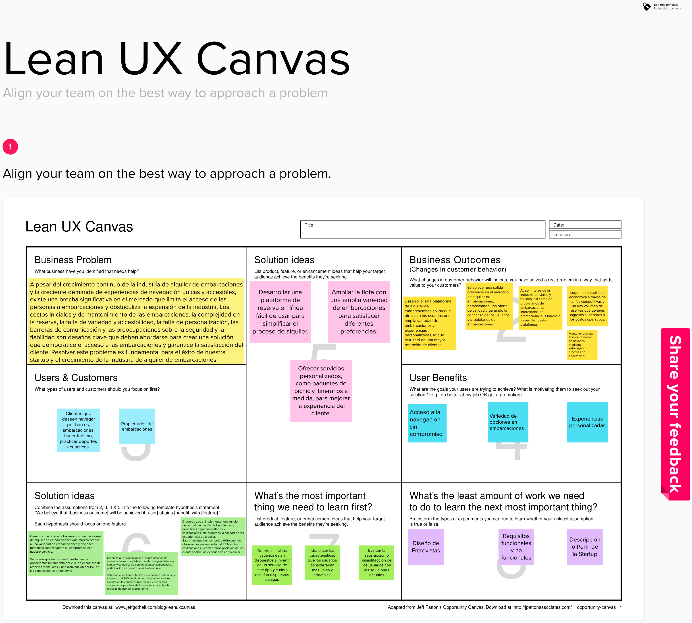

<h1 id="capitulo-1">Capítulo I: Introducción</h1>
<h3 id="startup-profile"></h3>1.1. Startup Profile</h2>
<h3 id="descripcion-startup">1.1.1. Descripción de la Startup</h3>

En la actualidad, el alquiler de embarcaciones se ha convertido en una opción de ocio y turismo cada vez más popular debido a una serie de tendencias y factores relevantes como el turismo local, tendencia de experiencias, accesibilidad financiera, avances tecnológicos, etc.
 
 
Swift Ship es una emocionante empresa de alquiler de embarcaciones que ofrece a los amantes del agua y la aventura la oportunidad de explorar paisajes acuáticos impresionantes de una manera cómoda y accesible. Nuestra misión es proporcionar experiencias inolvidables en el agua, fomentando la pasión por la navegación y conectando a las personas con la belleza de los océanos, ríos y lagos.
 
 
Nuestra vision es querer posicionarnos como líderes en el mercado de alquiler de embarcaciones en Lima y expandirnos a otras regiones costeras. Además, estamos comprometidos con la sostenibilidad y la conservación marina, trabajando para minimizar nuestro impacto ambiental y apoyar proyectos de preservación.

<h3 id="perfiles-integrantes">1.1.2. Perfiles de integrantes del equipo</h3>
Somos un equipo apasionado de entusiastas de la navegación, emprendedores y expertos en tecnología que trabajan juntos para ofrecer experiencias inolvidables en el agua y aprovechar las oportunidades en el mercado de alquiler de embarcaciones.
 
 

   <table>
      <thead>
         <tr>
            <th style="text-align: center;">Foto</th>
            <th style="text-align: center;">Miembro</th>
            <th style="text-align: center;">Descripciónn personal</th>
            <th style="text-align: center;">Código</th>
         </tr>
      </thead>
      <tbody>
         <tr>
            <td style="text-align: center;"></td>
            <td style="text-align: center;">Adrian Melgar</td>
            <td tyle="text-align: justify;">Soy estudiante de Ingeniería de Software en la UPC y, actualmente, me encuentro interesado en temas relacionados con el manejo de datos. Además de mis estudios, disfruto jugando videojuegos y cocinando. Dentro de nuestro grupo, siempre me esfuerzo por brindar apoyo y fomentar una comunicación constante entre los miembros.</td>
            <td style="text-align: center;">U201819465</td>
         </tr>
         <tr>
            <td style="text-align: center;"></td>
            <td style="text-align: center;">Sebastian Bustinza</td>
            <td style="text-align: justify;">Mi nombre es Diego Acuña Gomez, resido en Lima y tengo 21 años. Soy estudiante de la carrera de Ingeniería de Software en la Universidad Peruana de Ciencias Aplicadas, actualmente 7mo ciclo. Considero que tengo habilidades en programación con C++, Javascript y Python. Me comprometo a ayudar al trabajo y desarrollo de nuestro trabajo.</td>
            <td style="text-align: center;">U202123362</td>
         </tr>
         <tr>
            <td style="text-align: center;"></td>
            <td style="text-align: center;">Gianfranco Luna</td>
            <td style="text-align: justify;">Me gusta observar el comportamiento de las personas para así crear un ambiente cómodo y activo; soy práctico y racional para los percances que puedan surgir. Si bien poseo conocimientos básicos en la programación en el lenguaje C + +, aportaré en lo que pueda para realizar con éxito la idea planteada.</td>
            <td style="text-align: center;">U201824343</td>
         </tr>
         <tr>
            <td style="text-align: center;"></td>
            <td style="text-align: center;">Lorenzo Navarro</td>
            <td style="text-align: justify;">Estudiante de ingenieria de software. Actualmente enfocado en desarrollo movil y backend. En busqueda de mi primer internship y dispuesto a competir siempre en un nivel alto. </td>
            <td style="text-align: center;">U201713141</td>
         </tr>
      </tbody>
   </table>

 

<h3 id="solution-profile">1.2. Solution Profile</h3>
<h3 id="antecedentes-y-problematica">1.2.1 Antecedentes y problemática</h3>
<strong>What - ¿Cuál es el problema?</strong>
El problema que hemos identificado es que, a pesar de que muchas personas anhelan experimentar la emoción de navegar y disfrutar de aventuras acuáticas, enfrentan obstáculos significativos para hacerlo. La adquisición de una embarcación es costosa y puede ser un compromiso financiero abrumador. Esto limita el acceso a la navegación y la exploración de entornos acuáticos impresionantes. 
<strong>When - ¿Cuándo sucede el problema?</strong>Este problema surge cada vez que alguien sueña con escapar a las aguas y experimentar la belleza del mar, los ríos o los lagos, pero se enfrenta a las barreras financieras y logísticas que impiden que ese sueño se haga realidad. 

<strong>Where - ¿Dónde surge el problema?</strong>
El problema se manifiesta en diversas ubicaciones donde las personas desean acceder a embarcaciones, ya sea en zonas costeras, lagos, ríos o incluso en áreas urbanas con acceso a cuerpos de agua. También se experimenta en lugares donde el alquiler de embarcaciones no es fácilmente accesible o donde los costos son prohibitivos. 
<strong>Who - ¿Quiénes son afectados por el problema?</strong>Entusiastas de la navegación que desean disfrutar de la experiencia de navegar sin tener que poseer una embarcación.
Turistas y viajeros que buscan una forma única de explorar el destino que están visitando.
Personas que buscan celebrar ocasiones especiales, como aniversarios o cumpleaños, con una experiencia en el agua.
Aquellos que desean probar diferentes tipos de embarcaciones antes de tomar una decisión de compra. 
<strong>Why - ¿Cuál es la causa del problema?</strong> La principal causa del problema es la falta de acceso a embarcaciones debido a los altos costos de compra y mantenimiento. La mayoría de las personas no pueden permitirse el lujo de comprar y mantener una embarcación, lo que limita su capacidad para disfrutar de la navegación y la exploración acuática. 
<strong>How - ¿Cómo se llevan a cabo los hechos?</strong>Los hechos se desencadenan cuando las personas desean alquilar una embarcación para una aventura en el agua pero encuentran que las opciones disponibles son limitadas o costosas. Esto suele resultar en la renuncia a la experiencia o en la búsqueda de alternativas menos satisfactorias.
 
<strong>How much- ¿Cuál es la magnitud del problema?</strong>Según datos recopilados, se estima que un gran porcentaje de entusiastas de la navegación y viajeros potenciales se ven afectados por esta barrera financiera. A nivel global, la falta de acceso a embarcaciones puede limitar la participación en actividades acuáticas y la exploración de hermosos destinos costeros, lo que representa un mercado insatisfecho y un potencial de crecimiento significativo para nuestro servicio de alquiler de embarcaciones. 

<h3 id="lean-ux-process">1.2.2 Lean UX Process</a></h3>
<h3 id="lean-ux-problem-statements">1.2.2.1. Lean UX Problem Statements</a></h3>
En el contexto de la industria de alquiler de embarcaciones, enfrentamos una serie de desafíos significativos que afectan la experiencia de los clientes y la adopción de nuestro servicio. Los problemas predominantes incluyen la falta de acceso conveniente a una variedad de embarcaciones, la falta de información clara sobre las opciones disponibles, la complejidad de las reservas y la falta de orientación personalizada para los clientes.  
Esto lleva a una problemática importante: muchas personas se sienten abrumadas y desinformadas al planificar una experiencia de alquiler de embarcaciones, lo que disminuye su satisfacción y puede llevar a una disminución en la demanda de servicios de alquiler de embarcaciones.
 
 
El desafío que enfrentamos es evidente: ¿Cómo podemos garantizar que las personas tengan acceso fácil a una variedad de embarcaciones de calidad, reciban información clara sobre las opciones disponibles y disfruten de una experiencia de alquiler de embarcaciones sin problemas y altamente personalizada? ¿Cómo podemos simplificar el proceso y brindar orientación a los clientes para que tengan una experiencia excepcional en el agua?

<h3 id="lean-ux-assumptions">1.2.2.2. Lean UX Assumptions</h3>

<h4>Bussines Outcomes</h4>

   <ul>
      <li>Desarrollar una plataforma de alquiler de embarcaciones sólida que ofrezca a los usuarios una amplia variedad de embarcaciones y experiencias personalizadas, lo que resultará en una mayor retención de clientes.</li>
      <li>Establecer una sólida presencia en el mercado de alquiler de embarcaciones, demostrando una oferta de calidad y ganando la confianza de los usuarios y propietarios de embarcaciones.</li>
      <li>Atraer interés de la industria de viajes y turismo, así como de propietarios de embarcaciones interesados en promocionar sus barcos a través de nuestra plataforma.
      </li>
      <li>Lograr la rentabilidad económica a través de tarifas competitivas y un alto volumen de reservas que generen ingresos superiores a los costos operativos.</li>
      <li>Mantener una alta tasa de retención de usuarios mediante estrategias efectivas de fidelización.
</li>
   </ul>

<h4>User</h4>

   <ul>
      <li>Clientes que desean disfrutar de una experiencia de alquiler de embarcaciones única y personalizada, ya sea para la navegación recreativa, la pesca o cualquier otra actividad en el agua.</li>
      <li>Propietarios de embarcaciones que desean aumentar sus ingresos al alquilar sus embarcaciones de manera efectiva a través de nuestra plataforma.</li>
   </ul>

<h4>User Outcomes</h4>

   <h5>Clientes</h5>
   <ul>
      <li>Proporcionar a los clientes una amplia selección de embarcaciones y opciones de alquiler que se adapten a sus necesidades y preferencias individuales.</li>
      <li>Ayudar a los clientes a planificar y reservar una experiencia de alquiler de embarcaciones sin problemas y altamente personalizada.</li>
      <li>Ofrecer a los clientes una experiencia de usuario intuitiva y conveniente que les permita acceder fácilmente a información sobre embarcaciones, precios y opciones personalizadas.</li>
      <li>Facilitar la interacción de los clientes con propietarios de embarcaciones y proporcionar orientación personalizada para que disfruten al máximo de su experiencia.</li>
   </ul>

   <h5>Propietarios de Embarcaciones</h5>
   <ul>
      <li>Permitir a los propietarios de embarcaciones llegar a un público más amplio y aumentar sus ingresos a través del alquiler efectivo de sus embarcaciones.</li>
      <li>Facilitar la gestión de las reservas y la comunicación con los clientes, lo que les permite ofrecer un servicio de alquiler de alta calidad.</li>
   </ul>

<h4>Features</h4>

   <ul>
      <li>Plataforma de Reserva de Embarcaciones: Proporciona a los usuarios la capacidad de buscar y reservar una amplia variedad de embarcaciones, incluidas lanchas rápidas, veleros, yates, kayaks, etc.</li>
      <li>Perfiles de Usuarios: Permite a los usuarios crear perfiles personalizados para que puedan registrar sus preferencias y necesidades, como el tipo de embarcación que prefieren, la ubicación de salida, la duración del alquiler y cualquier requisito especial.</li>
      <li>Herramientas de Comunicación: Facilita la comunicación entre propietarios de embarcaciones y clientes para discutir detalles de la reserva, itinerarios personalizados y cualquier solicitud especial.
      </li>
      <li>Seguimiento de la Experiencia: Permite a los clientes realizar un seguimiento de su experiencia de alquiler, dejar comentarios y calificaciones, y proporcionar retroalimentación a los propietarios de embarcaciones.
      </li>
   </ul>

<h4>Suposiciones de negocio</h4>

<ol>
  <li><strong>Creo que mis usuarios necesitan</strong> acceso conveniente a una amplia variedad de embarcaciones y opciones de alquiler para que puedan planificar la experiencia de navegación perfecta.</li>
  <li><strong>Estas necesidades se pueden resolver</strong> con una plataforma en línea que ofrezca una selección diversa de embarcaciones, herramientas de reserva fáciles de usar y opciones personalizadas.</li>
  <li><strong>Mis clientes iniciales son</strong> aquellos que buscan disfrutar de una experiencia de alquiler de embarcaciones única, ya sea para fines recreativos, turísticos o de pesca. Además, incluye a propietarios de embarcaciones que desean alquilar sus barcos de manera efectiva.
</li>
  <li><strong>l valor #1 que un cliente quiere de mi servicio es</strong> poder planificar y reservar una experiencia de alquiler de embarcaciones sin problemas y altamente personalizada. Para los propietarios de embarcaciones, el valor principal es aumentar sus ingresos a través del alquiler efectivo de sus embarcaciones.</li>
  <li><strong>El cliente también puede obtener beneficios adicionales</strong>, como la facilidad de comunicación con propietarios de embarcaciones, acceso a itinerarios personalizados y retroalimentación de calidad. Además, los propietarios de embarcaciones se beneficiarán al poder gestionar sus reservas de manera eficiente y atraer a un público más amplio.</li>
  <li><strong>Voy a adquirir la mayoría de mis clientes a través de</strong> estrategias de marketing en línea, incluyendo publicidad en plataformas de viajes y redes sociales, y promocionando las experiencias de alquiler exitosas.</li>
  <li><strong>Haremos dinero a través de</strong> nuestra plataforma y tarifas de suscripción para propietarios de embarcaciones que deseen listar sus barcos y ofreceremos más funcionalidades.</li>
  <li><strong>Mi competencia principal en el mercado serán</strong>  otras plataformas de alquiler de embarcaciones y servicios de alquiler de embarcaciones tradicionales.</li>
  <li><strong>Los venceremos debido a que </strong>ofreceremos una amplia variedad de opciones y una experiencia de usuario altamente personalizada.</li>
  <li><strong>Mi mayor riesgo de producto son</strong> que los clientes encuentren dificultades técnicas o problemas en la plataforma al realizar reservas o al comunicarse con propietarios de embarcaciones. También es importante garantizar la seguridad de los datos de los usuarios. </li>
  <li><strong>Resolveremos esto a través de</strong> un desarrollo continuo de la plataforma, pruebas de usabilidad y medidas de seguridad sólidas para proteger la privacidad de los usuarios y la integridad de sus datos.
</li>
</ol>

<h4>Suposiciones de usuario</h4>

<ol>
   <li>
      <strong>¿Quién es el usuario?</strong>
      <ul>
         <li>Clientes que buscan disfrutar de una experiencia de alquiler de embarcaciones única y personalizada, incluye a personas que desean navegar recreativamente, pescar o participar en actividades acuáticas. Los clientes pueden variar en experiencia en navegación, desde principiantes hasta expertos.</li>
         <li>Propietarios de embarcaciones, aquellos que desean alquilar sus embarcaciones a través de nuestra plataforma para aumentar sus ingresos y llegar a una audiencia más amplia de posibles inquilinos.</li>
      </ul>
   </li>
   <li>
      <strong>¿Dónde encaja nuestro producto en su trabajo o vida?</strong>
      <ul>
         <li>Para los clientes, nuestra plataforma encaja en sus vidas como una herramienta esencial para planificar y reservar experiencias de alquiler de embarcaciones excepcionales. Les permite transformar sus deseos de navegación en realidad y mejorar sus momentos en el agua.</li>
         <li>Para los propietarios de embarcaciones, nuestro producto encaja en sus negocios permitiéndoles alcanzar un mercado más grande de inquilinos potenciales y gestionar eficazmente las reservas y comunicaciones relacionadas con el alquiler de sus embarcaciones.</li>
      </ul>
   </li>
   <li>
      <strong>¿Cómo y cuándo es usado nuestro producto?</strong>
      <ul>
         <li>Los clientes para buscar embarcaciones, planificar itinerarios, hacer reservas y obtener información relevante antes de su experiencia de alquiler. También pueden utilizarla durante su experiencia para comunicarse con el propietario de la embarcación o hacer un seguimiento de su viaje.</li>
         <li>Los propietarios, utilizan nuestra plataforma para listar sus embarcaciones, gestionar reservas y comunicarse con los inquilinos. La plataforma es esencial en su proceso de alquiler y para maximizar sus ingresos.</li>
      </ul>
   </li>
   <li>
      <strong>¿Qué problema tendría nuestro producto y cómo se pueden resolver?</strong>
      <ul>
         <li>Un problema potencial para los clientes podría ser la dificultad para encontrar la embarcación adecuada o realizar reservas. Para resolver esto, debemos garantizar una interfaz de usuario intuitiva y una búsqueda efectiva.</li>
         <li>Un problema podría ser la falta de visibilidad en la plataforma. Esto se solucionaría promoviendo estrategias efectivas de marketing y garantizando una presentación atractiva de sus embarcaciones.

</li>
      </ul>
   </li>
   <li>
      <strong>¿Qué características son importantes?</strong>
      <ul>
         <li>Características importantes incluyen una amplia selección de embarcaciones, información detallada sobre las mismas, opciones de personalización para el viaje y una forma sencilla de hacer reservas. Es esencial tener herramientas efectivas para listar sus embarcaciones, gestionar reservas y comunicarse con los inquilinos de manera eficiente.</li>
      </ul>
   </li>
   <li>
      <strong>¿Cómo debe verse nuestro servicio y cómo debe comportarse?</strong>
      <ul>
         <li>Nuestro servicio debe tener una apariencia atractiva y moderna para los clientes, con una interfaz de usuario fácil de navegar. Debe comportarse como una plataforma confiable que ofrece información precisa y procesos de reserva sin problemas.</li>
         <li>Para los propietarios de embarcaciones, nuestra plataforma debe ser fácil de usar y ofrecer una experiencia eficiente para administrar sus listados y comunicarse con los inquilinos.</li>
      </ul>
   </li>
</ol>

<h3 id="lean-ux-hypothesis-statement">1.2.2.3. Lean UX Hypothesis Statements</h3>

 <ul>
    <li>
        <strong>1ra Hipótesis:</strong>
        <ul>
            <li>Creemos que ofrecer a los usuarios una plataforma de alquiler de embarcaciones que ofrezca acceso a una variedad de embarcaciones y opciones personalizadas mejorará su compromiso con nuestro servicio.</li>
            <li>Sabremos que hemos tenido éxito cuando observemos un aumento del 20% en el número de reservas mensuales y una disminución del 15% en las cancelaciones de reservas.</li>
        </ul>
    </li>
    <li>
        <strong>2da Hipótesis:</strong>
        <ul>
            <li>Creemos que proporcionar a los propietarios de embarcaciones una plataforma efectiva para listar sus barcos y comunicarse con los clientes aumentará su participación en nuestro servicio de alquiler.</li>
            <li>Sabremos que hemos tenido éxito cuando notemos un aumento del 30% en el número de embarcaciones listadas en los primeros tres meses y recibamos comentarios positivos de los propietarios sobre la facilidad de uso de la plataforma.</li>
        </ul>
    </li>
    <li>
        <strong>3ra Hipótesis:</strong>
        <ul>
            <li>Creemos que al implementar una función de retroalimentación de los clientes y permitirles dejar comentarios y calificaciones, mejoraremos la calidad de las experiencias de alquiler.</li>
            <li>Sabremos que hemos tenido éxito cuando observemos un aumento del 25% en las calificaciones y comentarios positivos de los clientes sobre las experiencias de alquiler.</li>
        </ul>
    </li>
</ul>
<h3 id="lean-ux-canvas">1.2.2.4. Lean UX Canvas</h3>

 
 
  <a href="https://app.mural.co/t/works0599/m/works0599/1694192145971/9dc9c675bdf05a7bbb816f8a45b1bc96a325cfca?sender=u02657958e0bf79f3c7e04296 ">Enlace al Mural</a>

<h3 id="segmento-objetivo">1.3. Segmentos objetivo</h3>
En la actualidad, el alquiler de embarcaciones se ha convertido en una opción de ocio y turismo cada vez más popular debido a una serie de tendencias y factores relevantes como el turismo local, tendencia de experiencias, accesibilidad financiera, avances tecnológicos, etc.
  
1. Clientes que desean disfrutar de una experiencia de alquiler de embarcaciones única y personalizada, ya sea para la navegación recreativa, la pesca o cualquier otra actividad en el agua.  
2. Propietarios de embarcaciones que desean aumentar sus ingresos al alquilar sus embarcaciones de manera efectiva a través de nuestra plataforma.  
