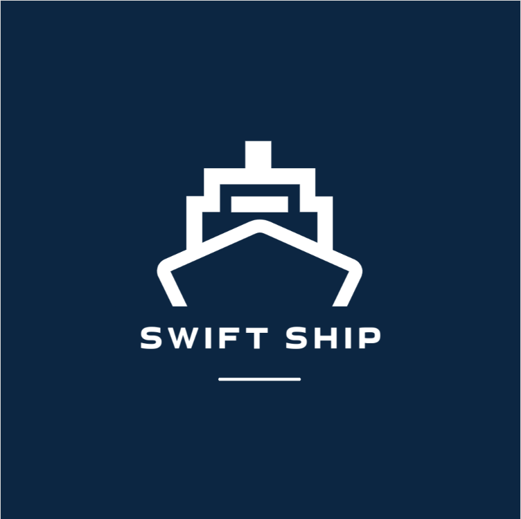
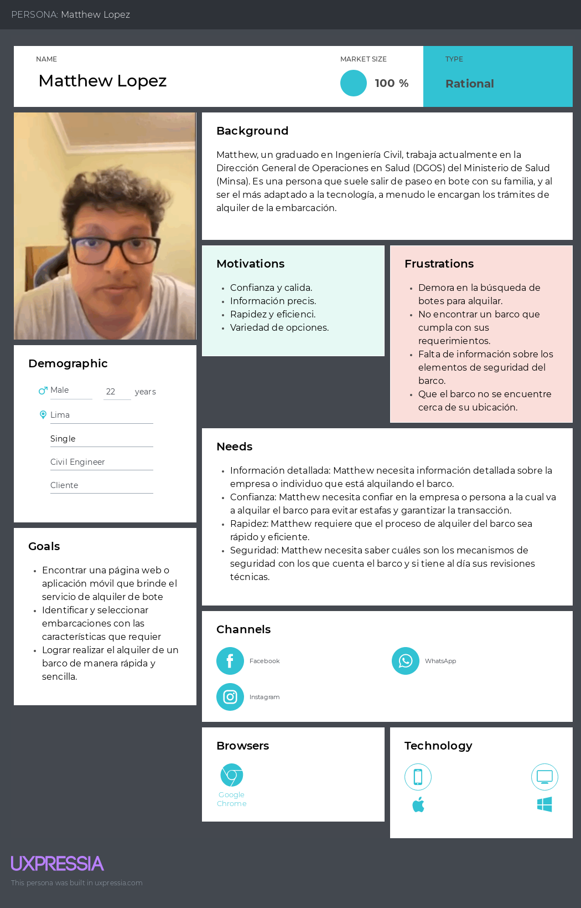
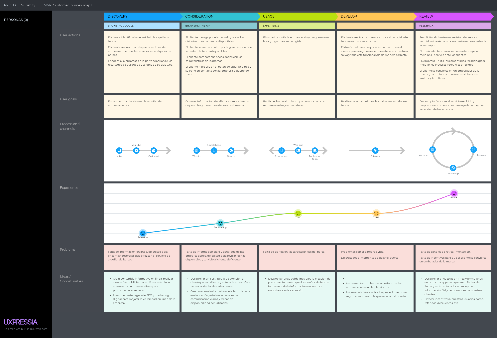
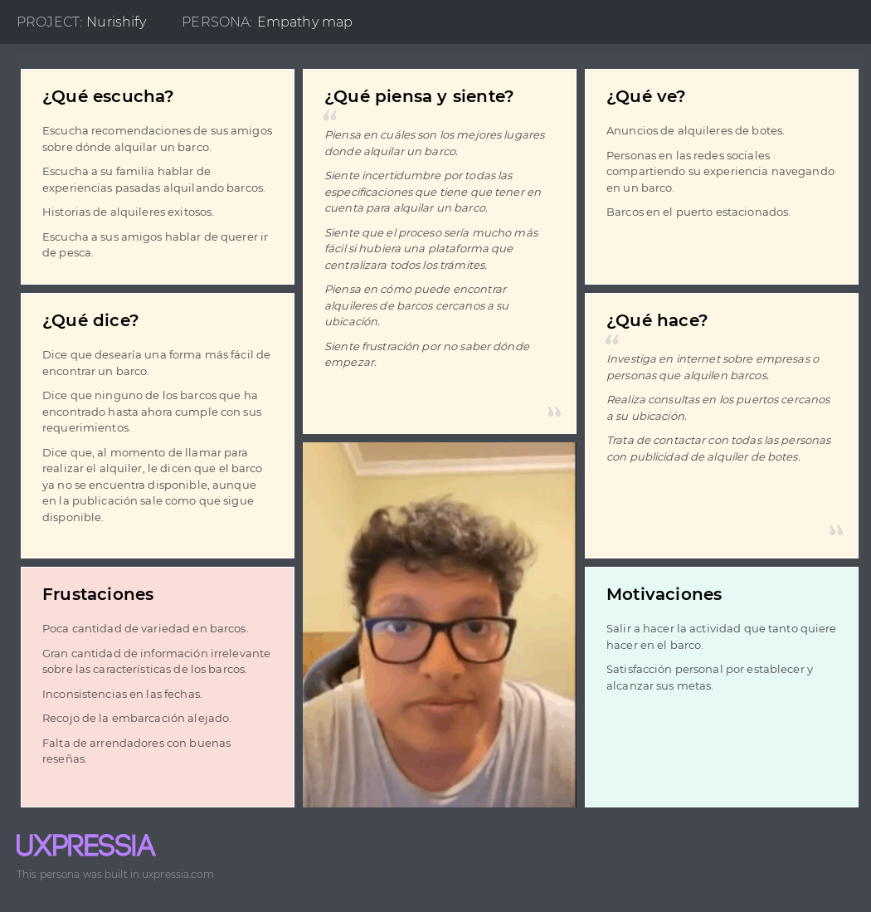
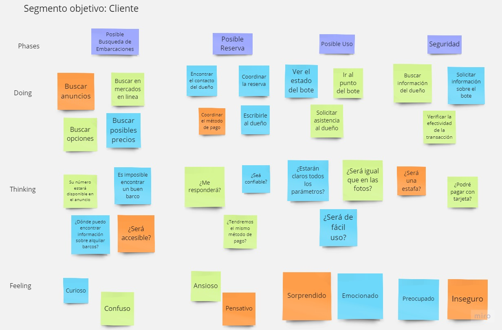

<h1 id="capitulo-2">Capítulo II: Requirements Elicitation & Analysis</h3>
<h3 id="competidores"><a>2.1. Competidores</a></h3>
<h3 id="analisis-competitivo"><a>2.1.1. Análisis competitivo</a></h3>

   <table>
      <thead>
         <tr>
            <th style="text-align: center;" colspan="6">Competitive Analysis Landscape</th>
         </tr>
      </thead>
      <tbody>
         <tr>
            <td style="text-align: center;" rowspan="2"><strong>¿Por qué llevar a cabo este análisis?</strong></td>
            <td style="text-align: center;" colspan="5"><strong>Este análisis nos permitirá conocer nuestra posición frente a nuestros competidores Además, podremos identificar nuestras fortalezas y debilidades.</strong></td>
         </tr>
         <tr>
            <td style="text-align: justify;" colspan="5">
               El objetivo principal del Competitive Analysis Landscape es conocer a nuestros competidores y contrastar nuestra percepción inicial sobre ellos. Queremos entender lo que ofrecen y, lo que es más importante, comprender en qué se fundamentan estas empresas en el mercado al que nuestro startup se está dirigiendo
            </td>
         </tr>
         <tr>
            <td style="text-align: center;" rowspan="6">Perfil</td>
         </tr>
         <tr>
            <td style="text-align: center;" rowspan="3">Overview</td>
         </tr>
         <tr>
            <td style="text-align: center;"></td>
            <td style="text-align: center;"></td>
            <td style="text-align: center;"></td>
            <td style="text-align: center;">Yates Peru</td>
         </tr>
         <tr style="text-align: justify;">
            <td>Swift Ship es una aplicación intermediaria entre el proveedor y el cliente que permite a este último encontrar rápidamente alquiladores de botes confiables cerca de él. Los proveedores cuentan con un canal en el cual pueden ofrecer sus botes en alquiler a un gran número de clientes, simplificando sus transacciones. Además, podrán visualizar gráficos analíticos.</td>
            <td>Click&Boat es una web-app que tiene como objetivo permitir a sus usuarios buscar y alquilar embarcaciones en cualquier parte del mundo.</td>
            <td>Alquiler de Yates Callo es una página web que tiene como objetivo permitir a sus usuarios alquilar cualquiera de las embarcaciones disponibles.</td>
            <td>Yates Perú es una página web que busca ayudar a sus usuarios a alquilar cualquiera de las embarcaciones disponibles en su catálogo.</td>
         </tr>
         <tr>
            <td style="text-align: justify;" rowspan="2">Ventaja competitiva ¿Qué valor ofrece a los clientes?
            </td>
         </tr>
         <tr style="text-align: justify;">
            <td>Ofrece una gran facilidad y rapidez para localizar proveedores de botes confiables.</td>
            <td>Habilidad para alquilar una embarcación en cualquier parte del mundo.</td>
            <td>Gran cantidad de embarcaciones, entre yates y veleros.</td>
            <td>Amplia cartera de embarcaciones con disponibilidad en Lima, Callao, Paracas, Pucusana y Máncora.</td>
         </tr>
         <tr>
            <td style="text-align: center;" rowspan="5">Perfil de Marketing</td>
         </tr>
         <tr>
            <td style="text-align: center;" rowspan="2">Mercado objetivo</td>
         </tr>
         <tr style="text-align: justify;">
            <td>Clientes entre los 18 y 65 años en Perú que tengan interés de alquilar un bote.</td>
            <td>Clientes entre los 18 y 65 años en cualquier parte del mundo que tengan interés de alquilar un bote.</td>
            <td>Clientes entre los 18 y 65 años en Perú que tengan interés de alquilar un bote.</td>
            <td>Clientes entre los 18 y 65 años en Perú que tengan interés de alquilar un bote.</td>
         </tr>
         <tr>
            <td style="text-align: center;" rowspan="2">Estrategias de Marketing</td>
         </tr>
         <tr style="text-align: justify;">
            <td>Promoción a través de diferentes canales digitales, como redes sociales, y/o a través de anuncios disponibles en internet.</td>
            <td>Publicidad mediante redes sociales.</td>
            <td>Publicidad por mediación de medios audiovisuales y redes sociales.</td>
            <td>Promoción a través de las redes sociales, así como en plataformas de transmisión y video en línea.</td>
         </tr>
         <tr>
            <td style="text-align: center;" rowspan="7">Perfil de Producto</td>
         </tr>
         <tr>
            <td style="text-align: center;" rowspan="2">Productos & Servicios</td>
         </tr>
         <tr style="text-align: justify;">
            <td>Encontrar al proveedor de servicios de alquiler de botes deseado mediante un buscador y filtro de búsqueda avanzada para encontrar a los botes de acuerdo con la necesidad del usuario y podrá revisar las reviews del proveedor.</td>
            <td>Ofrece una plataforma en la que sus usuarios pueden realizar búsquedas avanzadas con múltiples campos para encontrar la embarcación que mejor se les acomode.</td>
            <td>Ofrece una plataforma en la que sus usuarios pueden buscar y escoger la embarcación de su preferencia, contando con una gran cartera de navíos.</td>
            <td>Ofrece el servicio de alquiler de navíos y paseos en yate en distintas ciudades del Perú.</td>
         </tr>
         <tr>
            <td style="text-align: center;" rowspan="2">Precios & Costos</td>
         </tr>
         <tr style="text-align: justify;">
            <td>Gratuito para todo público que desee utilizar la app. Suscripciones para los proveedores del servicio de alquiler de botes.
               <ul>
                  <li>Basic: S/. 199 / mes (Max 1 barco)</li>
                  <li>Premium: S/. 599 / mes (Max 5 barco)</li>
                  <li>Enterprise: S/. 1999 / mes (Barcos ilimitados)</li>
               </ul></td>
            <td>Comisión de aproximadamente 10%.</td>
            <td>Comisión de aproximadamente 15% y perks adicionales como snacks y paseos</td>
            <td>Comisión de aproximadamente 15% y perks adicionales como:
            <ul>
               <li>Paseos y cenas romanticas en yate</li>
               <li>Alquiler yate para fiestas</li>
               <li>Despedida de soltera en yate</li>
               <li>Tour grupal en yate</li>
               <li>Paseo familiar en yate</li>
            </ul></td>
         </tr>
         <tr>
            <td style="text-align: center;" rowspan="2">Canales de distribución (Web y/o Móvil)</td>
         </tr>
         <tr style="text-align: justify;">
            <td>Aplicación Web</td>
            <td>Aplicación Web</td>
            <td>Aplicación Web</td>
            <td>Aplicación Web</td>
         </tr>
         <tr>
            <td style="text-align: center;" rowspan="10">Análisis SWOT</td>
         </tr>
         <tr>
            <td style="text-align: center;" colspan="5">Realice esto para su startup y sus competidores. Sus fortalezas deberían apoyar sus oportunidades y contribuir a lo que ustedes definen como su posible ventaja competitiva. </td>
         </tr>
         <tr>
            <td style="text-align: center;" rowspan="2">Fortalezas</td>
         </tr>
         <tr style="text-align: justify;">
            <td>Mayor rapidez al momento de encontrar y alquilar un barco.</td>
            <td>Cobertura a nivel mundial.</td>
            <td>Buena cartera de barcos y buenas reviews en sus redes sociales.</td>
            <td>Cobertura en múltiples ciudades de Perú y múltiples temáticas para escoger al momento de alquilar un yate.</td>
         </tr>
         <tr>
            <td style="text-align: center;" rowspan="2">Debilidades</td>
         </tr>
         <tr style="text-align: justify;">
            <td>Poca experiencia debido a un reciente comienzo en el mercado local.</td>
            <td>Poca selección de navíos dependiendo de la ubicación.</td>
            <td>La unica forma de alquilar un barco es mediante correo o mensajes por WhatsApp</td>
            <td>La única forma de alquilar un barco es mediante correo, mensajes por WhatsApp o llamada telefónica.</td>
         </tr>
         <tr>
            <td style="text-align: center;" rowspan="2">Oportunidades</td>
         </tr>
         <tr style="text-align: justify;">
            <td>Aumento de potenciales clientes que muestran interés en la renta de embarcaciones.</td>
            <td>Colaborar con organizaciones o arrendadores de barcos para expandir su cartera de embarcaciones.</td>
            <td>Respaldarse de ingenieros de software y especialistas en diseño para una reestructuración de su aplicación web.</td>
            <td>Respaldarse de ingenieros de software y especialistas en diseño para una reestructuración de su aplicación web.</td>
         </tr>
         <tr>
            <td style="text-align: center;" rowspan="2">Amenazas</td>
         </tr>
         <tr style="text-align: justify;">
            <td>Que los posibles competidores establezcan su propia vía de comunicación entre el proveedor y el cliente.</td>
            <td>Alto índice de competitividad entre las aplicaciones de alquiler de barcos locales - un poco complicado destacarnos ante la gran marea de estos que hay en el mercado</td>
            <td>Alto índice de competitividad entre las aplicaciones que ofrecen el servicio de alquiler de barcos, lo que dificulta destacar en el mercado.</td>
            <td>Alto índice de competitividad entre las aplicaciones que ofrecen el servicio de alquiler de barcos, lo que dificulta destacar en el mercado.</td>
         </tr>
      </tbody>
   </table>

<h3 id="strategias-y-tacticas-frente-a-competidores"><a>2.1.2. Estrategias y tácticas frente a competidores</a></h3>

Tras un análisis exhaustivo de nuestros competidores, hemos identificado áreas de mejora que aún no han sido abordadas. Estas debilidades pueden ser aprovechadas para destacar y mejorar nuestro proyecto frente a la competencia. Las ventajas competitivas que planeamos desarrollar incluyen:
<ol>
   <li>Programas de capacitación en atención al cliente</li>
   <li>Colaboraciones con bloggers de viajes y patrocinio de eventos locales relacionados con la navegación.</li>
   <li>Actualizaciones de software regulares según las necesidades.</li>
   <li>Implementación de una sección de retroalimentación para recibir comentarios de los usuarios sobre la interfaz.</li>
   <li>Establecimiento de un chat para la comunicación con los dueños de botes.</li>
</ol>

<h3 id="entrevistas"><a>2.2. Entrevistas</a></h3>
<h3 id="diseño-de-entrevistas"><a>2.2.1. Diseño de entrevistas</a></h3>

**Preguntas generales:**

1. ¿Cuál es tu nombre y edad?
2. ¿En que distrito vives?
3. ¿A qué te dedicas actualmente?
4. ¿Cuáles son las redes que más usas?
5. ¿Qué tipo de dispositivo móvil usas?
6. ¿De qué sistema operativo es la computadora o laptop que utilizas?
7. ¿Cuál es el buscador que utilizas en tus dispositivos?

**Preguntas Específicas para Clientes:**

1. ¿Alguna vez has alquilado un barco?
2. ¿Por qué lo alquilaste?
3. ¿Cuál fue el medio que utilizaste para buscar dónde alquilar un barco?
4. ¿En qué te fijas al momento de alquilar un barco?
5. ¿Consideras que una aplicación, ya sea web o móvil, para el servicio de alquiler de barcos es mejor que contactar con el proveedor de manera tradicional?
6. ¿Cuáles son los factores más importantes que estarías buscando en el servicio ofrecido de alquiler de barcos?

**Preguntas Específicas para Intermediarios:**

1. ¿Cuál es el proceso de contrato al recibir la solicitud de alquiler de barcos?
2. ¿En qué área se desempeña y qué actividades realiza?
3. ¿Cuál es su criterio de busqueda de empresas o dueños de barcos? ¿Existe más beneficios trabajanado con empresas o con dueños independientes?
4. ¿Cuál es el procedimiento ante algún accidente o evento ambiental?
5. ¿Consideras factible una aplicación donde puedas encontrar tanto clientes mineras y empresas de alquiler de barcos?

<h3 id="registro-de-entrevistas">2.2.2. Registro de entrevistas</h3>

### **Usuario cliente**

<h4>Entrevista 1</h4>

| Nombre | Apellido | Edad |  Distrito   |
| :----- | :------- | :--: | :---------: |
| Donny  | Enriquez |  22  | La Victoria |

<strong>URL: </strong> <a href="https://youtu.be/Oe27gjQdHzk" target="_blank">Entrevista Donny Enriquez</a>

Resumen entrevista: Donny, un estudiante de gastronomía en la USIL que vive en La Victoria, utiliza con mayor frecuencia Instagram, WhatsApp y ocasionalmente Facebook. Cuenta con un dispositivo móvil Apple y una computadora de escritorio Windows. Para ambos, el buscador Google Chrome es su preferido. Donny ha alquilado un barco en el pasado, específicamente para celebrar su cumpleaños. Cuando intentó encontrar un barco para alquilar, enfrentó desafíos considerables y dedicó un tiempo considerable a buscar en diversas plataformas, como Facebook Marketplace, contactos personales y publicaciones en Google.  Los principales obstáculos que Donny encontró durante su búsqueda incluyeron la falta de coherencia en las fechas de disponibilidad. A veces, las publicaciones indicaban que la embarcación estaba disponible, pero al llamar, se le informaba que ya no lo estaba. Además, Donny buscaba un barco con suficiente capacidad para su fiesta y que permitiera eventos a bordo.  Al momento de alquilar un barco, Donny se enfoca en el aforo, un precio razonable, el estado de la embarcación, las fechas disponibles y la presencia de medidas de seguridad. Donny considera que nuestra aplicación es revolucionaria y sería de gran ayuda para muchos usuarios. Quedó sorprendido por la falta de información y opciones en línea para el alquiler de barcos, a pesar de que es similar al alquiler de automóviles, que es más fácil de encontrar.  Donny sugiere que la plataforma debe contar con una amplia selección de proveedores de embarcaciones, y cada proveedor debe ser contactable directamente desde la aplicación. Las publicaciones de las embarcaciones deben incluir información esencial, como el aforo, el precio, la disponibilidad de medidas de seguridad, fotos de la embarcación, reseñas de otros usuarios y un calendario de disponibilidad para evitar confusiones sobre las fechas de alquiler.

<h4>Entrevista 2</h4>

| Nombre        | Apellido      | Edad | Distrito |
| :------------ | :------------ | :--: | :------: |
| Matthew Andre | Lopez Sanchez |  22  | Suquillo |

<strong>URL: </strong> <a href="https://youtu.be/5WwkAw4ClbY" target="_blank">Entrevista Matthew Andre Lopez Sanchez</a>

Resumen entrevista: Matthew, un graduado en Ingeniería Civil que vive en Surquillo, trabaja actualmente en la Dirección General de Operaciones en Salud (DGOS) del Ministerio de Salud (Minsa), donde se encarga del mantenimiento de infraestructuras hospitalarias. Sus plataformas preferidas para obtener información son Instagram y Facebook. Cuenta con un dispositivo móvil Apple y una computadora de escritorio Windows. Para ambos, el buscador Google Chrome es su preferido. Matthew nos informa que ha alquilado un barco en el pasado, siendo la última vez que lo hizo para disfrutar de una jornada de pesca en familia. Sin embargo, se enfrentó a dificultades para encontrar información relevante sobre el alquiler de embarcaciones debido a la escasez de recursos en línea. Utilizó Google, Facebook Marketplace e Instagram para su búsqueda, aunque no tuvo éxito en esta última plataforma.  Matthew señala que sus criterios principales al buscar un barco eran garantizar que todos los miembros de su familia tuvieran suficiente espacio a bordo y no se sintieran apretados. Además, la ubicación del barco era un factor crucial, ya que a veces se encontraban en puertos lejanos de Lima, lo que complicaba la logística. Por último, aunque el precio del alquiler no era su principal preocupación, consideraba importante que fuera razonable.  Matthew valora positivamente la idea de nuestra aplicación y considera que sería de gran utilidad tanto para él como para otros usuarios que estén en busca de alquilar o encontrar un barco. Opina que el éxito de la plataforma dependerá de una amplia selección de embarcaciones disponibles, información precisa sobre su disponibilidad, detalles como la capacidad, fecha de fabricación, estado de las revisiones técnicas y el precio. También sugiere que la plataforma incluya un historial de comentarios de personas que hayan alquilado el mismo barco previamente, para brindar una perspectiva adicional a los futuros usuarios.

### **Usuario propietarios de embarcaciones**

<h4>Entrevista 1</h4>

| Nombre  | Apellido | Edad |
| :------ | :------- | :--: |
| Jessica | Morales  |  48  |

<strong>URL: </strong> <a href="https://youtu.be/nv7xe4Ecb5k?si=MmMWX_0EhdJv_9ZS" target="_blank">Entrevista a Jessica Morales</a>

Resumen entrevista: Jessica Morales, actualmente labora en Serpac, una empresa intermediaria que genera contacto entre empreass mineras y empresas de alquiler de barcos especializados en transporte de ocbre o Zinc. Esta encargada del área de operaciones, en el cuál su labor es generar un contrato "fletamento" donde se encuentran las clausulas ante cualquier evento que pueda surgir durante el transporte, de igual manera se genera un doucmento, "Estado de hechos" del cual las 3 partes deben generar. En este documento es registrado las actividades antes, durante y despues del arrivo. Finalmente, se llega a un acuerdo con las 3 partes referente al calculo final del "Estado de hechos", donde Serpac actúa como el intermediario para poder generar un acuerdo que satisfaga a ambas partes. 

<h3 id="analisis-de-entrevistas">2.2.3. Análisis de entrevistas</h3>

Después de llevar a cabo las entrevistas planificadas con el cliente y los alquiladores de barcos, hemos recopilado información valiosa para el proyecto actual.

#### Usuario Cliente

#### Análisis objetivo:

Se pone de manifiesto la necesidad de una solución unificada para el alquiler de embarcaciones. Los clientes subrayan la importancia de una publicación clara, la comunicación con los propietarios de las embarcaciones y una transacción rápida y segura. Esta demanda podría abordarse mediante la utilización de plataformas digitales que faciliten una comunicación fluida entre los arrendadores de embarcaciones y los clientes.  También existe una necesidad de confianza en los arrendadores de embarcaciones y los clientes, lo que podría ser abordado a través de la implementación de sistemas de calificación y reseñas en línea que permitan a los clientes evaluar a los arrendadores.  Además, se precisa de un impecable control de las revisiones técnicas que debe tener la embarcación al día para garantizar la seguridad de nuestros usuarios.  En general, Swift Ship podría abordar todas estas necesidades al proporcionar una plataforma en línea que facilite el contacto con arrendadores de barcos, la implementación de un sistema de calificación y reseñas en línea para aumentar la confianza en los arrendadores y el exhaustivo control de las revisiones técnicas y de seguridad con las que deben contar los barcos para asegurar la seguridad de los clientes.

<h3 id="needfinding">2.3. Needfinding</h3>

Needfinding es un paso esencial que implica la búsqueda y comprensión de las necesidades del mercado. Identificar estas necesidades a través de la investigación nos permite generar soluciones innovadoras basadas en las demandas concretas de los usuarios.

<h3 id="user-personas">2.3.1. User Personas</h3>

#### Cliente

   

<h3 id="user-task-matrix">2.3.2. User Task Matrix</h3>

Se efectúa un análisis de las funciones clave identificadas en la problemática, fundamentado en los comentarios recopilados de los dos grupos de usuarios: Cliente y Dueño de barcos.

   <table>
      <thead>
         <tr>
            <th style="text-align: center;" rowspan="1" colspan="5">Swift Ship's Task Matrix</th>
         </tr>
      </thead>
      <tbody>
         <tr>
            <td rowspan="3" colspan="1" style="text-align: center;">Task Matrix</td></tr>
         <tr>
            <td rowspan="1" colspan="2" style="text-align: center"> Cliente </td>
            <td rowspan="1" colspan="2" style="text-align: center"> Dueño de barcos </td></tr>
         <tr>
            <td style="text-align: center">Frecuencia</td>
            <td style="text-align: center">Importancia</td>
            <td style="text-align: center">Frecuencia</td>
            <td style="text-align: center">Importancia</td></tr>
         <tr>
            <td style="text-align: center">Búsqueda de Embarcaciones</td>
            <td style="text-align: center">Siempre</td>
            <td style="text-align: center">Alta</td>
            <td style="text-align: center">A veces</td>
            <td style="text-align: center">Baja</td></tr>
         <tr>
            <td style="text-align: center">Filtrar y Comparar</td>
            <td style="text-align: center">Siempre</td>
            <td style="text-align: center">Media</td>
            <td style="text-align: center">A veces</td>
            <td style="text-align: center">Baja</td></tr>
         <tr>
            <td style="text-align: center">Realizar Reservas</td>
            <td style="text-align: center">Siempre</td>
            <td style="text-align: center">Alta</td>
            <td style="text-align: center">Nunca</td>
            <td style="text-align: center">Media</td></tr>
         <tr>
            <td style="text-align: center">Comunicación con Propietarios</td>
            <td style="text-align: center">Siempre</td>
            <td style="text-align: center">Alta</td>
            <td style="text-align: center">Nunca</td>
            <td style="text-align: center">Baja</td></tr>
         <tr>
            <td style="text-align: center">Evaluación y Reseñas</td>
            <td style="text-align: center">Siempre</td>
            <td style="text-align: center">Alta</td>
            <td style="text-align: center">Siempre</td>
            <td style="text-align: center">Alta</td></tr>
         <tr>
            <td style="text-align: center">Registro de Embarcaciones</td>
            <td style="text-align: center">Nunca</td>
            <td style="text-align: center">Bajo</td>
            <td style="text-align: center">Siempre</td>
            <td style="text-align: center">Alta</td></tr>
         <tr>
            <td style="text-align: center">Gestión de Calendario</td>
            <td style="text-align: center">A veces</td>
            <td style="text-align: center">Bajo</td>
            <td style="text-align: center">Siempre</td>
            <td style="text-align: center">Alta</td></tr>
         <tr>
            <td style="text-align: center">Comunicación con Clientes</td>
            <td style="text-align: center">Siempre</td>
            <td style="text-align: center">Alta</td>
            <td style="text-align: center">A veces</td>
            <td style="text-align: center">Media</td></tr>
         <tr>
            <td style="text-align: center">Aprobación de Reservas</td>
            <td style="text-align: center">Nunca</td>
            <td style="text-align: center">Media</td>
            <td style="text-align: center">Siempre</td>
            <td style="text-align: center">Alta</td></tr>
         <tr>
            <td style="text-align: center">Mantenimiento y Seguridad</td>
            <td style="text-align: center">Siempre</td>
            <td style="text-align: center">Alta</td>
            <td style="text-align: center">Siempre</td>
            <td style="text-align: center">Alta</td></tr>
            <tr>
            <td style="text-align: center">Seguimiento de Evaluaciones</td>
            <td style="text-align: center">A veces</td>
            <td style="text-align: center">Alta</td>
            <td style="text-align: center">Siempre</td>
            <td style="text-align: center">Media</td></tr>
            <tr>
            <td style="text-align: center">Soporte al Client</td>
            <td style="text-align: center">Siempre</td>
            <td style="text-align: center">Alta</td>
            <td style="text-align: center">Siempre</td>
            <td style="text-align: center">Alta</td></tr>
            <tr>
            <td style="text-align: center">Manejo de Pagos</td>
            <td style="text-align: center">Siempre</td>
            <td style="text-align: center">Alta</td>
            <td style="text-align: center">Siempre</td>
            <td style="text-align: center">Alta</td></tr>
      </tbody>
   </table>

<h3 id="user-journey-mapping">2.3.3. User Journey Mapping</h3>

#### **Segmento 1:** Cliente que desea alquilar un barco

   

<h3 id="empathy-mapping">2.3.4. Empathy Mapping</h3>

En esta sección, se muestra el Empathy Mapping de los tres segmentos a los que nos dirigimos. Utilizamos esta herramienta para identificar a nuestra audiencia objetivo, comprender su contexto y sus requerimientos, lo que nos permite ver el mundo desde su punto de vista.

#### Cliente

   

<h3 id="as-is">2.3.5. As-is Scenario Mapping</h3>

