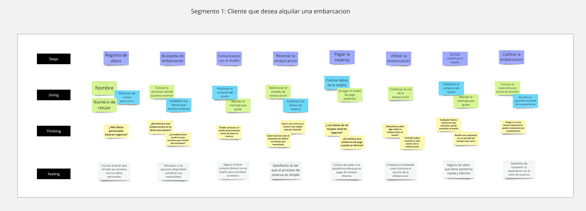
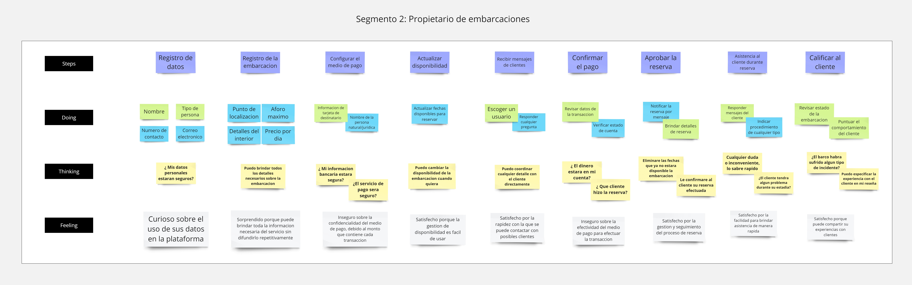
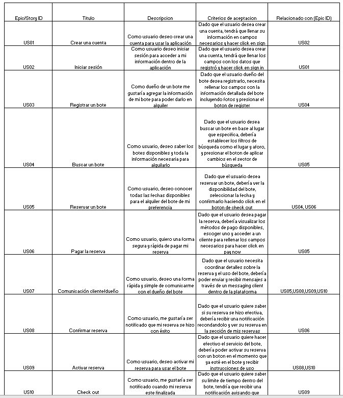
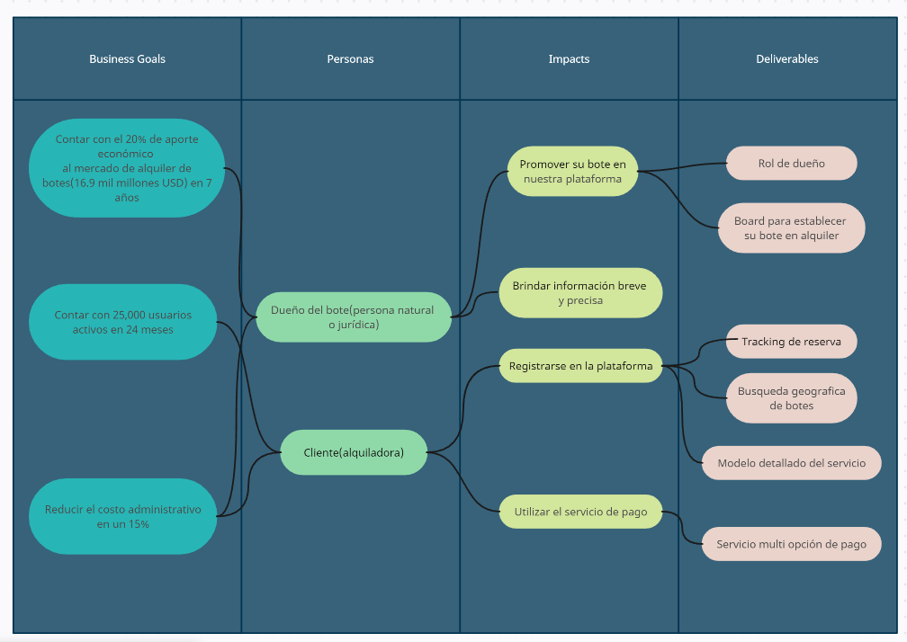
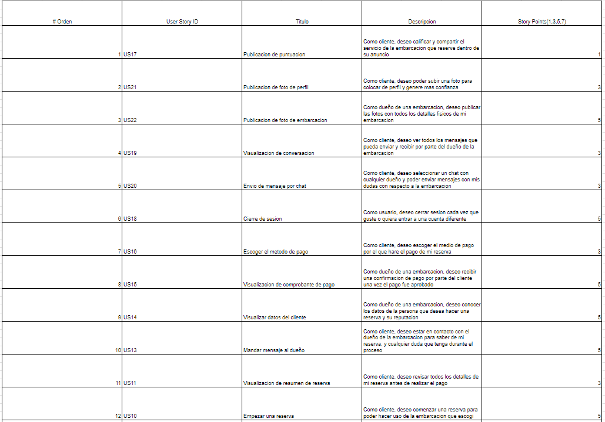
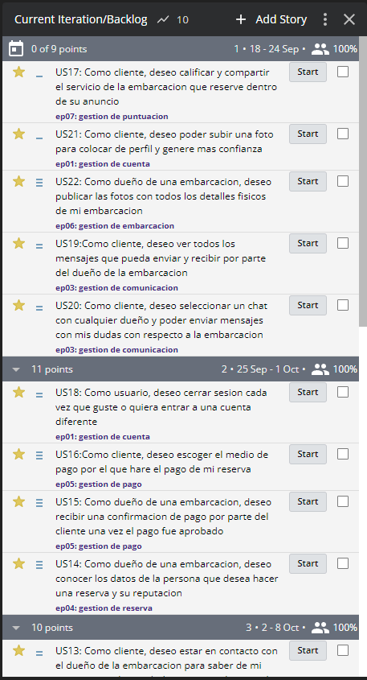

<h1><a id="capitulo-3">Capítulo III: Requirements Specification</a></h1>
<h3><a id="to-be">3.1. To-Be Scenario Mapping</a></h3>
<h4>Segmento 1. Cliente que reservara la embarcacion</h4>

 
Se presenta la version nuestro primer segmento objetivo, el cliente que desea reservar una embarcacion, en la que indican la satisfaccion de la plataforma al utilizar nuestro proceso simple de reserva. 
 
<h4>Segmento 2. Dueño de una embarcacion</h4>

 
Nuestro segundo segmento objetivo, el dueño de una embarcacion que desea publicar sus servicios, indica su avance y satisfaccion utilizando nuestra plataforma. 
 
Enlace de nuestro <a href="https://miro.com/app/board/uXjVMiY4EcQ=/?share_link_id=396936615711" target="_blank">To-Be Scenario</a>
<h3 id="user-stories">3.2. User Stories</h3>

   En esta seccion se presentan las user stories correspondientes a nuestra aplicacion incluyendo el landing page y los servicios web desde el segmento developer. Se describen las caracteristicas que requieren nuestros dos segmentos objetivos, nuestros criterios de aceptacion y las relaciones con Epics correspondientes
   
    
   Enlace de los <a href="https://docs.google.com/spreadsheets/d/1OkDbz_ln8PR15yImS_z5vyMBKfeW-zrW2aR4voMLBxM/edit?usp=sharing">User Stories</a>

<h3 id="impact-mapping">3.3. Impact Mapping</h3>

   
    
   Enlace del <a href="https://uxpressia.com/w/qsUXW/i/wQVaJ">Impact Mapping</a>

<h3 id="product-backlog">3.4. Product Backlog</h3>

   
    
   
    
   Enlace del product backlog en <a href="https://www.pivotaltracker.com/n/projects/2677748">Pivotal Tracker</a> y <a href="https://docs.google.com/spreadsheets/d/1Y_r28xXyDESpcPT8EGihChXtTKlph7SG5NzbYnCCF-E/edit?usp=sharing">Drive</a>

