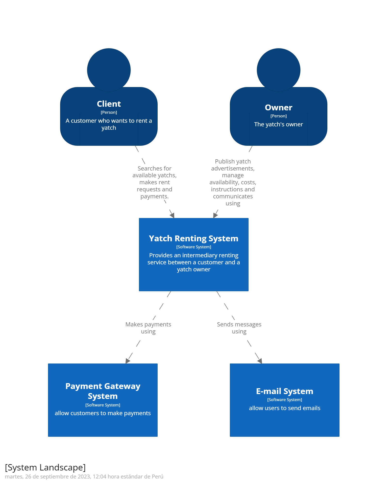

<h1 id="capitulo-4">Capítulo IV: Product Design</h1>
<h3 id="style-guidelines">4.1. Style Guidelines</h3>
<h3 id="general-style-guidelines">4.1.1. General Style Guidelines</h3>
Brand Name

El nombre del software identificado es Swift Ship. Descomponiendo el nombre en dos, ‘swift’ que significa rápido y ‘ship’ que significa nave. Originalmente surgió a partir de la necesidad identificada, pues los usuarios requieren de personal especializado en contactar y gestionar a los propietarios para conseguir una reserva rápidamente, por ello se optó por la búsqueda de propietarios de barcos. Específicamente en el idioma inglés pues nos pareció más amigable y llamativo con los posibles usuarios. A continuación, se presenta el logo o marca de nuestra solución propuesta.
 
 

 
 

 
 
Con el propósito de dar estilo y reconocimiento, nuestra app web posee una gran variedad de ajustes en los temas de colores, las fuentes de tipografía y en el aspecto de diseño estructural.
 
 
Typography
 
 

 
 

Colors
 
 

Spacing
 
 

 
 
Tono de comunicación y lenguaje aplicado
 
 
Color Primario: El color azul suele relacionarse con elementos de la naturaleza, tales como el agua y el aire. Además, inspira sentimientos de amistad, lealtad, seguridad y confianza.
 
 
Color Secundario: El verde, además de transmitir tranquilidad y calma, se asocia con la naturaleza, prosperidad, fertilidad, salud, y generosidad.
 
 
Blanco: Representa limpieza y claridad.
 
 Desktop Web Browseto con entusiasmo y perseverancia. Puesto que se incluirán experiencias y recomendaciones que aumentarán las perspectivas del usuario.

<h3 id="web-style-guidelines">4.1.2. Web Style Guidelines</h3>
Desarrollaremos una aplicación que se adeque a cualquier dispositivo tecnológico sin la necesidad de malograr el diseño del contenido. Por ello, se tendrá que tomar en cuenta cada tipo de dispositivo para que el contenido este estructurado de la mejor manera para cada uno.
 
 

 
 

 
 

<h3 id="information-architecture">4.2. Information Architecture</h3>
La arquitectura de información que se tiene planeado implementar en “Swift-Ship”, permitirá a los usuarios encontrar lo que desean de la manera más simple y dinámica posible. Entre nuestras propuestas tenemos: contar con un sistema de búsquedas en el menú principal. En este apartado, los usuarios tendrán la posibilidad de consultar y encontrar empresas de barcos que sean de su interés, así como también escoger el tipo de barco que deseen por medio de un filtro, así como la empresa a la que esta afilidad. Por otro lado, el usuario podrá recibir ofertas y recomendaciones en base a sus intereses y la época del año, tales como actividades que sean parecidas a sus anteriores alquileres, empresas que ofrezcan barcos similares, entre otros. Creemos que, de esta manera, nuestros clientes podrán interesarse en utilizar la aplicación y ser consumidores activos.

<h3 id="organization-systems">4.2.1. Organization Systems</h3>
El sistema de organización que se planea implementar para “Swift-Ship”, les permitirá a los usuarios visualizar la interfaz de forma atractiva, para que sea fácil de usar. Dicho sistema de organización poseerá temas específicos y recomendaciones en base a sus intereses seleccionados en el registro, el diseño está hecho de tal manera que el cliente no se pierda. Se realizará el uso de la organización secuencial (step-by-step to accomplish) o matricial.
<h3 id="labeling-systems">4.2.2. Labeling Systems</h3>
Los datos se van a representar en botones con imágenes y frases cortas de tal manera que a los usuarios les sea sencillo a la hora de cambiar sección y aumentando su tiempo en la app. Esto también ayudará al usuario a navegar de manera intuitiva ya que los colores seleccionados ayudarían a enfocar la percepción del usuario.

<h3 id="meta-tags">4.2.3. SEO Tags and Meta Tags</h3>

En el siguiente apartado, se expondrán los etiquetas SEO y etiquetas meta empleados en la Landing Page con la finalidad de mejorar su presencia en los resultados de búsqueda de los motores de búsqueda. Página de Aterrizaje:

<h3 id="searching-systems">4.2.4. Searching Systems</h3>
Para la búsqueda de áreas, en cada página habrá un buscador libre y una herramienta de filtros por categorías para encontrar los barcos con una categoría asignada por los moderadores de la app.
<h3 id="navigation-systems">4.2.5. Navigation Systems</h3>
Si el usuario inicia sesión con su cuenta, llegará a la página principal de la app, donde se visualizará sus datos importantes, en la parte inferior se encontrará un panel de navegación con las opciones principales como “Perfil”, “Categorías”, “Personalizaciones”, “Configuración”. Cuando el usuario decida ir a cualquier opción le aparecerá una nueva ventana con el título de la opción previamente seleccionada con otras posibilidades.
Por ejemplo:
Abrir “Categorías” y seleccionar “Transporte”, al marcar esta opción lo llevará a una pantalla donde podrá seleccionar el monto y el material a transportar, sean minerales, propiedades, etc.

<h3 id="landing-page-ui-design">4.3. Landing Page UI Design</h3>

Las Landing Pages son herramientas destinadas a convertir a los visitantes en posibles clientes mediante diversas estrategias, como mensajes atractivos y detalles sobre tu producto, entre otros recursos. Por esta razón, optamos por emplear esta herramienta y creamos una versión preliminar tanto para dispositivos móviles como para computadoras.

En la versión móvil, ofrecemos el mismo contenido que en la versión de escritorio, pero hemos rediseñado la presentación para adaptarla al tamaño de los dispositivos móviles. Además, hemos incorporado un botón que facilita la navegación del usuario en la Landing Page, garantizando una experiencia más Scómoda y visualmente atractiva.

Para la versión de escritorio, hemos diseñado ventanas con opciones detalladas que mejoran la comprensión del usuario. Cada opción del sitio web se describe claramente para evitar cualquier confusión. La barra de navegación se mantiene en una posición estática en todo momento, lo que asegura su disponibilidad constante para el usuario y le permite explorar la Landing Page de manera cómoda.

<h3 id="landing-page-wireframe">4.3.1. Landing Page Wireframe</h3>

En esta sección, presentaremos los fundamentos para diseñar el sitio web de nuestro software. Estos fundamentos nos ayudarán a brindar una comprensión más clara del contenido que la plataforma y la versión móvil mostrarán. El Landing Page se ajustará al tamaño de las pantallas de cada dispositivo, asegurando que la información esté centrada y sea fácilmente visible para el usuario. Nuestro objetivo es proporcionar información precisa sin abrumar al usuario, y para lograrlo, hemos incorporado una barra de navegación estática que facilitará la exploración de la Landing Page.

  

  

  

  

<strong>URL: </strong> <a href="https://www.figma.com/community/file/1282459073116716814/Swift-Ship---Landing-Page" target="_blank">Swift Ship Figma</a>

<h3 id="landingpage-mock-up">4.3.2. Landing Page Mock-up</h3>
Se muestra una vista previa de lo que constituirá nuestro sitio web, describiendo en detalle su contenido, aplicando los colores correspondientes según nuestra guía de estilos y complementando la información con imágenes coherentes. Esto se hace con el objetivo de brindar al usuario una comprensión más nítida de las ideas que estamos tratando de comunicar.

  

  

  

  

  

<strong>URL: </strong> <a href="https://www.figma.com/community/file/1282459073116716814/Swift-Ship---Landing-Page" target="_blank">Swift Ship Figma</a>

<h3 id="web-applications-ux-ui-design">4.4. Web Applications UX/UI Design</h3>
<h3 id="web-applications-wireframes">4.4.1. Web Applications Wireframes</h3>
<h3 id="web-applications-wireflow-diagrams">4.4.2. Web Applications Wireflow Diagrams</h3>
<h3 id="web-applications-mock-ups">4.4.2. Web Applications Mock-ups</h3>

<h3 id="web-applications-user-flow-diagrams">4.4.3. Web Applications User Flow Diagrams</h3>
<h3 id="web-applications-prototyping">4.5. Web Applications Prototyping</h3>
<h3 id="domain-driven-software-architecture">4.6. Domain-Driven Software Architecture</h3>
En esta seccion se presentan los diagramas de la arquitectura de software con aplicacion de patrones de diseño de alto nivel, bajo el enfoque Domain Driven, para una comunicacion efectiva de nuestro diseño de arquitectura.
<h3 id="software-architecture-context-diagram">4.6.1. Software Architecture Context Diagram</h3>

   
    
   Enlace del <a href="https://structurizr.com/share/86348/diagrams#SystemLandscape-001">Software Architecture Context Diagram</a>

<h3 id="software-architecture-container-diagrams">4.6.2. Software Architecture Container Diagrams</h3>

   
    
   Enlace del <a href="https://structurizr.com/share/86372">Software Architecture Container Diagrams</a>

<h3 id="software-architecture-components-diagrams">4.6.3. Software Architecture Components Diagrams</h3>
<h3 id="software-object-oriented-design">4.7. Software Object-Oriented Design</h3>
<h3 id="class-diagrams">4.7.1. Class Diagrams</h3>

   
    
   Enlace del <a href="https://lucid.app/lucidchart/606c6a40-b4fb-4e14-8776-22f4ed6201a9/edit?viewport_loc=-806%2C-1462%2C5900%2C4094%2C0_0&invitationId=inv_de107ff1-d207-45e1-af65-03dbb1e72a67" target="_blank">Object-Oriented Class Diagram</a>

<h3 id="class-dictionary">4.7.2. Class Dictionary</h3>
En esta sección se presenta el diccionario de clases que se utilizan para el desarrollo de nuestra solución
- <strong>User</strong>: representa a nuestros usuarios en la plataforma, contiene atributos y metodos relacionados con la gestión de información personal y de sesión.
- <strong>Customer</strong>: representa a los clientes que hacen reserva de embarcaciones dentro de nuestra aplicación. Contiene métodos que permite ver información sobre las reservas que se realice.
- <strong>Owner</strong>: representa a los dueños de las embarcaciones. Esta clase incluye métodos de gestión de sus publicaciones para poder crear anuncios cada vez que el dueño lo quiera.
- <strong>Review</strong>: representa la calificación y experiencia que se le puede asignar tanto a cualquiera de nuestros dos segmentos objetivos así como cualquier embarcación.
- <strong>Card</strong>: representa la información bancaria de nuestros dos segmentos objetivos, la información relevante de esta clase es el numero de serie de su tarjeta, cvv y fecha de expiración.
- <strong>Transaction</strong> : representa a la información relevante de pago al momento que ya se estableció una fecha y tipo de embarcación. Su contenido más importante es el id de la transacción, el monto y la persona que lo recibió.
- <strong>Receipt</strong> : representa al comprobante de la transacción que el usuario realiza al completar el proceso de pago de la solicitud de reserva de la embaracación.
- <strong>RentRequest</strong>: representa al proceso que se inicia cuando un usuario quiere reservar una embarcación y presiona el boton de reservar. Primero tendría que seleccionar las fechas disponibles y el proceso empieza a ejecutarse.
- <strong>Location</strong>: representa los detalles de los puntos de localización disponibles para cada una de las embarcaciones. 
- <strong>BoatCreator</strong>: representa los detalles del bote que está reservando el cliente. En este caso se dan a conocer sus especificaciones antes de poder iniciar una reserva.
- <strong>RentingHistory</strong>: representa al historial de reserva que cada cliente pueda tener durante su uso de la aplicación. Cambia su contenido cuando realiza una nueva solicitud de reserva y termina pagandola de forma exitosa.
- <strong>ChatHistory</strong>: representa a todo el contenido de comunicación disponible en la cuenta de cualquier usuario. 

<h3 id="database-design">4.8. Database Design</h3>
<h3 id="database-diagram">4.8.1. Database Diagram</h3>

   
   Enlace del <a href="https://drive.google.com/file/d/1mwNodBR4TPsnHXjihuqTsxCJYA6vmpj4/view?usp=sharing" target="_blank">Database Diagram</a>

