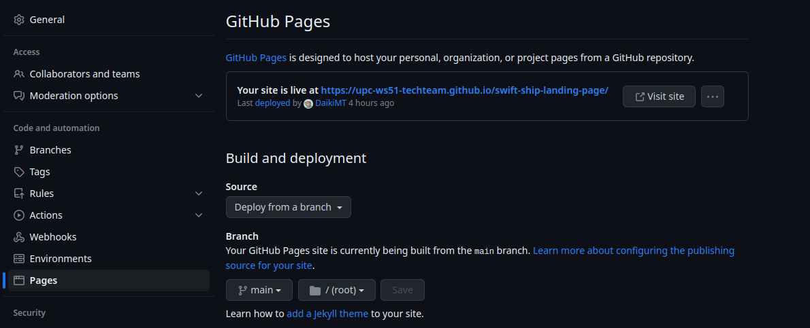

<h1 id="capitulo-5">Capítulo V: Product Implementation, Validation & Deployment</h1>

<h3 id="software-configuration-management">5.1. Software Configuration Management</h3>

A continuación, se describen las elecciones y acuerdos que facilitarán que el equipo mantenga la coherencia a lo largo de todo el proceso de desarrollo de nuestra solución.

<h3 id="software-development-environment-configuration">5.1.1. Software Development Environment Configuration</h3>

En esta sección, se incluyen los enlaces a las aplicaciones y productos de software que se crearon durante el transcurso del proyecto, organizados según las siguientes categorías:</br></br>

- Gestión de Proyectos
- Gestión de Requisitos
- Diseño de Experiencia de Usuario/Interfaz de Usuario de Productos
- Desarrollo de Software
- Pruebas de Software
- Documentación de Software

Además, se clasificarán los elementos de estas secciones como vínculos de referencia (para software basado en modelos SaaS) o enlaces de descarga (para productos que se ejecutan en las computadoras de los miembros del equipo) de cada uno de los productos de software.

<h4>Project Management</h4>

La Gestión de Proyectos es una disciplina centrada en la administración de proyectos, con el propósito principal de optimizar los procedimientos y su entorno para lograr los resultados deseados. En el ciclo de vida digital del proyecto, se llevará a cabo la implementación de un producto de software mediante un modelo SaaS que funcionará a través de un navegador web. No obstante, no se planea desarrollar una versión de aplicación móvil para dicho producto.

<h4>Requirements Managment</h4>

La Gestión de Requisitos es el proceso de asegurar que una organización documente, verifique y satisfaga las necesidades y expectativas de sus clientes, así como las de las partes interesadas internas y externas.

- <strong>Pivotal Tracker:</strong> Esta herramienta se describe como una plataforma utilizada para la gestión de historias de usuarios, agrupándolas en epics y clasificándolas en función de su puntuación en el programa. Se eligió debido a que permite que cada miembro del equipo comparta una visión en tiempo real de lo que está sucediendo en cada proyecto, ya sea contribuyendo en diferentes secciones o ajustando el flujo del proyecto.

<h4>Product UX/UI Design</h4>

Esta herramienta posibilita la creación del modelo de nuestro producto de forma digital, integrándolo en la vida del consumidor. En este caso, se llevó a cabo la elaboración de un diseño de sitio web adaptable tanto para computadoras como para dispositivos móviles.

- <strong>Uxpressia:</strong> Se trata de una herramienta en línea diseñada para mapear la experiencia del cliente, generando mapas de impacto y perfiles de personas. Gracias a sus funcionalidades, pudimos establecer los fundamentos para la creación de perfiles de usuario, mapas de empatía y mapas de recorrido del cliente.</br>https://uxpressia.com/.

- <strong>MIRO:</strong> Por su parte, MIRO es una pizarra digital colaborativa en línea que resulta útil para actividades de investigación, ideación y generación de lluvias de ideas, así como la creación de mapas mentales.</br>https://miro.com/app/dashboard/

- <strong>Figma:</strong> se presenta como una herramienta de prototipado web y un editor de gráficos vectoriales que se distingue de otras soluciones al estar disponible en línea, lo que facilita la creación de diseños para versiones tanto de navegadores web como de navegadores móviles.</br>https://www.figma.com/design/.

- <strong>Lucid Chart:</strong> se presenta como una herramienta de diagramación en línea que posibilita a los usuarios colaborar y trabajar conjuntamente en tiempo real, permitiendo la creación de diseños UML, mapas mentales, prototipos de software y una variedad de otros tipos de diagramas.</br>https://lucid.app/lucidchart/.

- <strong>Overflow:</strong> es una herramienta de diagramación que ofrece la capacidad de trabajar de manera colaborativa en tiempo real. Utilizamos esta herramienta para crear diagramas de flujos de usuario (Userflows).</br>https://userflow.com/app/.

<h4>Software Development</h4>

El desarrollo de software se refiere a un marco de trabajo aplicado al proceso de creación de un producto de software. Este enfoque se utiliza para establecer un proceso que guía el desarrollo del software, y cada uno de sus componentes describe un enfoque específico para las diversas actividades que ocurren durante el proceso.

- <strong>GitHub:</strong> Es una plataforma de repositorio comunitario que se utiliza para almacenar y gestionar los avances de un proyecto desarrollado por un grupo de personas. Puedes acceder al repositorio en

- <strong>WebStorm:</strong> WebStorm es un entorno de desarrollo de JetBrains, una empresa dedicada al desarrollo de software, que se enfoca en la programación web en JavaScript. Esta herramienta ofrece facilidades para probar sitios web en navegadores como Google. En el proyecto, se utilizará para brindar soporte en el desarrollo de lenguajes como HTML, CSS y JavaScript.

- <strong>HTML:</strong> Este lenguaje es utilizado en el desarrollo de plataformas web y se centra en la creación de hipertextos que enlazan a otros documentos. HTML proporciona herramientas para el diseño de sitios web y es compatible con CSS y JavaScript. En el proyecto actual, se empleará HTML para la documentación de la página web.

- <strong>CSS:</strong> Es un lenguaje de diseño destinado al entorno web que se utiliza para dar forma a la interfaz de usuario previamente diseñada, incorporando elementos como colores, tamaños y otros aspectos visuales. Además, CSS permite crear un estilo de diseño que puede compartirse en la web, complementando así el contenido elaborado en HTML. En nuestro proyecto, emplearemos este lenguaje para implementar el diseño de nuestra plataforma web.

- <strong>JavaScript:</strong> Se trata de un lenguaje de programación que es interpretado por otros programas. Funciona bajo el paradigma de programación orientada a objetos (POO) y permite la creación de prototipos sin implementación utilizando clases. Este lenguaje posibilita la creación de dinámicas para el usuario a través de la lógica de la programación. Lo utilizaremos para desarrollar las interacciones dinámicas en la plataforma web.

<h4>Software Documentation</h4>

La documentación de software se refiere a un conjunto de textos escritos o ilustraciones que acompañan a un programa de computadora o que están integrados en el código fuente del mismo. Su propósito es explicar cómo opera el software y cómo se utiliza.

<h3 id="source-code-management">5.1.2. Source Code Management</h3>

A continuación, se presenta la gestión del código fuente, también conocida por sus siglas en inglés SCM (Source Code Management). Su principal función es rastrear las modificaciones que el equipo realizará durante el desarrollo de sus proyectos en los repositorios de código fuente. Se utilizará como un sistema de control de versiones que permite hacer un seguimiento de los cambios efectuados por cada miembro o desarrollador en el proyecto. Es importante destacar que para el sistema de control de versiones emplearemos <strong>GitHub</strong>.

- URL de la organización: https://github.com/upc-ws51-techteam
- URl del repositorio del informe: https://github.com/upc-ws51-techteam/swift-ship-informe
- URL de repositorio del landing page: https://github.com/upc-ws51-techteam/swift-ship-landing-page
- URl del repositorio del frontend: https://github.com/upc-ws51-techteam/swift-ship-single-page-application

<h4>GitFlow</h4>

Este modelo alternativo de creación de ramas en Git se ha convertido en una herramienta esencial para muchos desarrolladores en los últimos años. Este flujo de trabajo de control de versiones hace uso de ramas y fue introducido y popularizado por Vincent Driessen. Su función principal es facilitar la organización de las versiones de un código, permitiendo la creación ordenada de nuevas características (Features) y correcciones rápidas (Hotfixes).


Como se mencionó anteriormente, en GitFlow se trabaja con ramas. A continuación, se describen las ramas principales que se utilizarán en el flujo de trabajo de nuestro proyecto:

<strong>Rama Principal</strong>

- <strong>Master:</strong> Esta es la rama principal a partir de la cual se ramificarán todas las demás ramas. Contendrá la versión más reciente y las versiones anteriores creadas por los desarrolladores. Esta rama almacenará el historial de publicación oficial del proyecto.
- <strong>Develop:</strong> Esta rama puede crearse a partir de la rama Master y contendrá todas las características estables. A través de esta rama, el equipo podrá integrar las funcionalidades.

<h4>Support Branches:</h4>

A diferencia de las ramas principales, estas ramas tienen una vida útil limitada, ya que se eliminarán después de realizar la fusión con sus ramas principales correspondientes.

<strong>Feature:</strong>

- Se bifurca de: develop.
- Debe fusionarse nuevamente en: develop.

Estas ramas se utilizan para desarrollar nuevas funciones que se integrarán en la próxima versión. Es importante destacar que esta rama existe mientras se encuentra en proceso de desarrollo. Una vez que el desarrollador haya completado la función, se fusionará nuevamente con la rama develop.

<strong>Convenciones para nombrar las ramas Feature:</strong>

<strong>Feature Branch:</strong> feature/nombre
<strong>Ejemplos:</strong>
feature/bienvenida,
feature/acerca,
feature/mi_funcionalidad

<h3 id="source-code-style-guide-&-conventions">5.1.3. Source Code Style Guide & Conventions</h3>

En esta sección, se presentarán las pautas, convenciones, estilos y principios que se aplicarán a cada uno de los lenguajes utilizados en la creación de nuestra aplicación, DocSeeker. La observancia de este conjunto de reglas es de suma importancia, ya que tiene como objetivo mantener la calidad estructural del software, mejorar la legibilidad del código fuente y facilitar el mantenimiento del mismo.

Dado que en este proyecto se emplearán HTML, CSS, JavaScript, Java y TypeScript para la codificación de la plataforma web, así como Gherkin para el proceso de pruebas del programa, a continuación se detallarán y describirán las reglas y recomendaciones generales que se seguirán al utilizar estos lenguajes.

<strong>Nomenclatura General</strong>

Para los nombres de variables, objetos, elementos y funciones que se utilicen, se asignarán términos en inglés que estén relacionados y puedan describir lo que representan. No se utilizarán mayúsculas, ya que, según W3Schools (s.f.), la combinación de mayúsculas y minúsculas dificulta la legibilidad y el uso exclusivo de minúsculas mejora la legibilidad del código.

Ejemplos de nomenclatura estándar según Google (s.f.):

```html
.gallery {} .video {} .login {}
```

<strong>Sangría</strong>

Cuando se utilice HTML, CSS y/o JavaScript, se aplicará un espaciado antes de cada línea que se encuentre dentro de un bloque. Este espacio debe ser de dos espacios, y según W3Schools (s.f.), no se debe utilizar la tecla de "Tabulación".

Ejemplo de nomenclatura estándar para la sangría en HTML según W3Schools (s.f.):

```html
<table>
	<tr>
		<th>Name</th>
		<th>Description</th>
	</tr>
</table>
```

Este tipo de formato garantiza una mayor claridad y legibilidad en el código, lo que facilita su comprensión y mantenimiento.

Declaración del Tipo de Documento (Declare Document Type)

El tipo de documento debe declararse en la primera línea de código. De acuerdo con Google (s.f.), HTML5 es la mejor práctica para la sintaxis de cualquier documento HTML. Para declararlo, simplemente es necesario copiar lo siguiente:

<strong>HTML (Lenguaje de Marcado de Hipertexto)</strong>

HTML, abreviado por las siglas del nombre en inglés HyperText Markup Language, es un lenguaje de marcado que se utiliza para definir la estructura de una página web. Además, proporciona funciones para controlar el comportamiento de varias partes del contenido de la página, como cambiar el tamaño del texto o aplicar formato en cursiva, entre otras.

En nuestro proyecto, emplearemos HTML5, y a continuación, se presentan las características y pautas que debemos seguir al utilizar este lenguaje:

- <strong>Declare Document Type</strong>

El tipo de documento debe declararse en la primera línea de código. De acuerdo con Google (s.f.), HTML5 es la mejor práctica para la sintaxis de cualquier documento HTML. Para declararlo, simplemente es necesario copiar lo siguiente:

```html
<!DOCTYPE html>
```

- <strong>Blank Lines</strong>

Cada vez que después de un bloque, lista o tabla de gran longitud se inicie uno nuevo, se debe agregar una línea en blanco para mejorar la legibilidad y la claridad, tal como lo indica W3Schools (s.f.).

Ejemplo:

```html
<body>
	<h1>Famous Cities</h1>

	<h2>Tokyo</h2>
	<p>
		Tokyo is the capital of Japan, the center of the Greater Tokyo Area, and the most populous
		metropolitan area in the world.
	</p>

	<h2>London</h2>
	<p>London is the capital city of England. It is the most populous city in the United Kingdom</p>

	<h2>Paris</h2>
	<p>
		Paris is the capital of France. The Paris area is one of the largest population centers in
		Europe.
	</p>
</body>
```

<h4>CSS</h4>

CSS, abreviado por las siglas del nombre en inglés Cascading Style Sheets, es un lenguaje de estilo que se enfoca en definir y mejorar la presentación de un documento basado en HTML. A continuación, se presentan las pautas que debemos seguir al utilizar CSS:

<strong>Separación de la Lógica y la Presentación</strong>

Es importante separar la lógica y la presentación en un documento web. Esto significa que las reglas de estilo CSS deben estar en un archivo separado y no en el documento HTML directamente. Se utiliza la propiedad style en las etiquetas HTML solo en casos excepcionales.

<strong>Uso de Selectores</strong>

Se deben utilizar selectores CSS adecuadamente para aplicar estilos a elementos específicos en la página web. Los selectores pueden ser etiquetas HTML, clases, IDs u otros atributos.

<strong>Evitar Estilos en Línea</strong>

Se debe evitar la aplicación de estilos directamente en línea utilizando el atributo style en las etiquetas HTML. En su lugar, se deben definir en el archivo de estilo CSS externo.

<strong>Cascada de Estilos</strong>

CSS sigue una cascada de prioridades en la aplicación de estilos. Esto significa que se pueden aplicar múltiples reglas de estilo a un elemento y el navegador determinará cuál prevalece en función de la especificidad del selector y la regla más reciente.

<strong>Reutilización de Estilos</strong>

Se debe fomentar la reutilización de estilos utilizando clases CSS para aplicar el mismo estilo a múltiples elementos en lugar de duplicar reglas de estilo.

<strong>Comentarios en el Código</strong>

Es una buena práctica incluir comentarios en el código CSS para explicar el propósito de las reglas de estilo y facilitar la comprensión y el mantenimiento del código.

<strong>Responsividad</strong>

Se debe tener en cuenta el diseño responsive para que la página se adapte adecuadamente a diferentes tamaños de pantalla, como dispositivos móviles y tablets.

Estas son algunas de las pautas generales que se deben seguir al utilizar CSS para mejorar la presentación de un documento HTML.

<h4>JavaScript</h4>

JavaScript es un lenguaje de programación que permite especificar de manera precisa las acciones que debe ejecutar el navegador, definiendo el orden de las tareas y la cantidad de veces que se realizarán. A continuación, se presentan las pautas para el uso de JavaScript en nuestro proyecto:

<strong>Inclusión de JavaScript</strong>

Se debe incluir el código JavaScript en un archivo externo con extensión .js y enlazarlo en el documento HTML utilizando la etiqueta script. Esto ayuda a separar la lógica del código del contenido HTML.

```javascript
<script src="miarchivo.js"></script>
```

Si es necesario, se pueden incluir scripts directamente en el archivo HTML utilizando la etiqueta script, pero esto debe hacerse en casos excepcionales.

```javascript
<script>// Código JavaScript aquí</script>
```

<strong>Comentarios</strong>

Es importante incluir comentarios en el código JavaScript para explicar su funcionalidad. Esto facilita la comprensión del código por parte de otros desarrolladores y el mantenimiento futuro.
javascript

```javascript
// Este es un comentario de una línea

/*
   Este es un comentario
   de varias líneas
   */
```

<strong>Buenas Prácticas de Programación</strong>

Se deben seguir las buenas prácticas de programación, como utilizar nombres de variables y funciones descriptivos, evitar el uso excesivo de variables globales y mantener un código limpio y organizado.

<strong>Manipulación del DOM</strong>

JavaScript se utiliza comúnmente para manipular el DOM (Document Object Model), lo que permite interactuar con elementos HTML y modificar su contenido, estilo y comportamiento.

<strong>Manejo de Eventos</strong>

Se pueden añadir manejadores de eventos para responder a acciones del usuario, como clics de botones o interacciones de teclado.

<strong>Validación de Datos</strong>

JavaScript también se utiliza para validar datos ingresados por el usuario en formularios y asegurarse de que cumplan con ciertos criterios.

<strong>Seguridad</strong>

Es importante tener en cuenta la seguridad al escribir código JavaScript para prevenir vulnerabilidades como ataques de inyección de código.

<strong>Pruebas y Depuración</strong>

Realizar pruebas exhaustivas y depuración (debugging) para identificar y corregir posibles errores en el código JavaScript.
Estas son las pautas generales que se deben seguir al utilizar JavaScript en nuestro proyecto. El uso adecuado de JavaScript permitirá crear interacciones dinámicas y mejorar la experiencia del usuario en la plataforma web.

<h3 id="software-deployment-configuration">5.1.4. Software Deployment Configuration</h3>

Como se mencionó previamente, la gestión de nuestro código fuente se llevará a cabo a través de GitHub, y utilizaremos GitHub Pages para la publicación y despliegue de la página.

Para el desarrollo del Landing Page de Swift Ship, se han empleado las siguientes herramientas:

<strong>HTML:</strong> Este lenguaje de marcado se utilizó para estructurar nuestro Landing Page. Puedes encontrar evidencia de esto en los archivos HTML, siendo el principal "index.html", donde todos los miembros del equipo reunieron el contenido desarrollado en sus ramas individuales.
La combinación de estas herramientas permitirá la creación y publicación eficiente de la página web de Theraphy.

</br>HTML</br>

</br>CSS</br>

</br>JS</br>

</br>

<h4>Deploy landing page</h4>
El deploy del landing page se realizo con GitHub pages


</br></br>

</br>

<h3 id="landing-page-services-&-applications-implementation">5.2. Landing Page, Services & Applications Implementation</h3>
