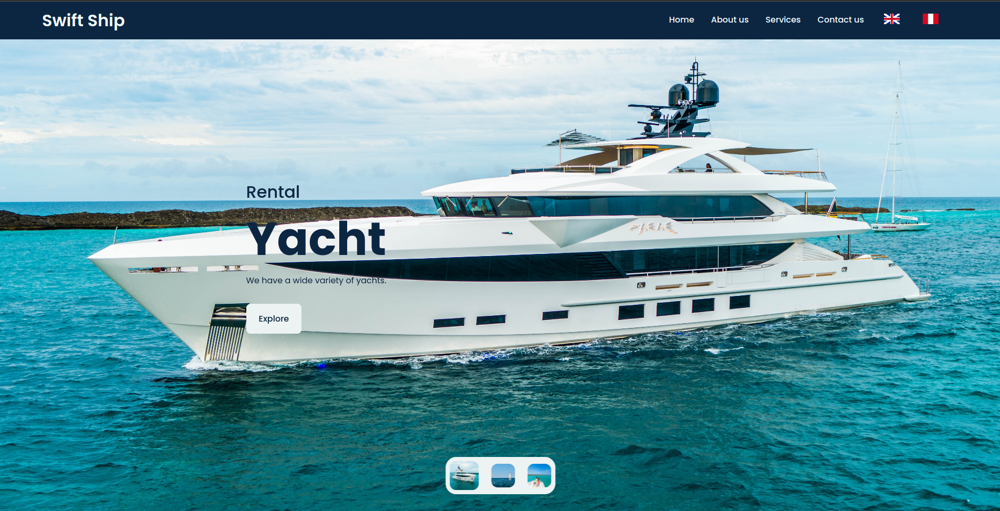
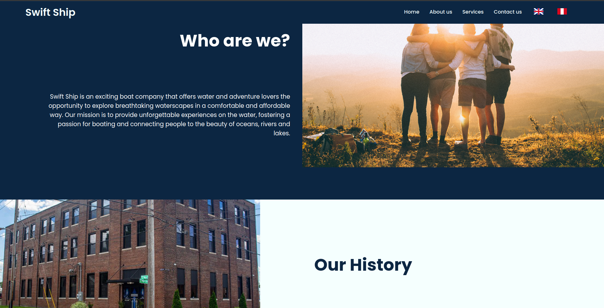
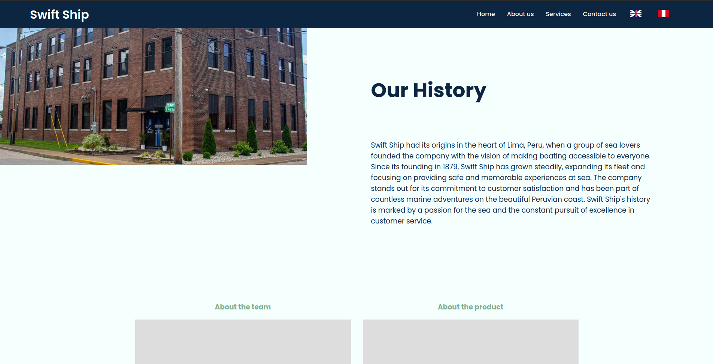
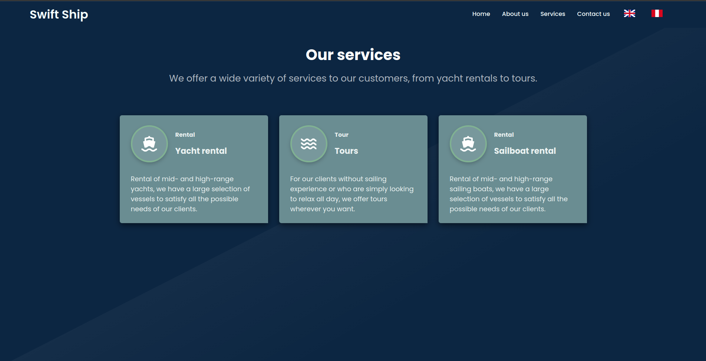
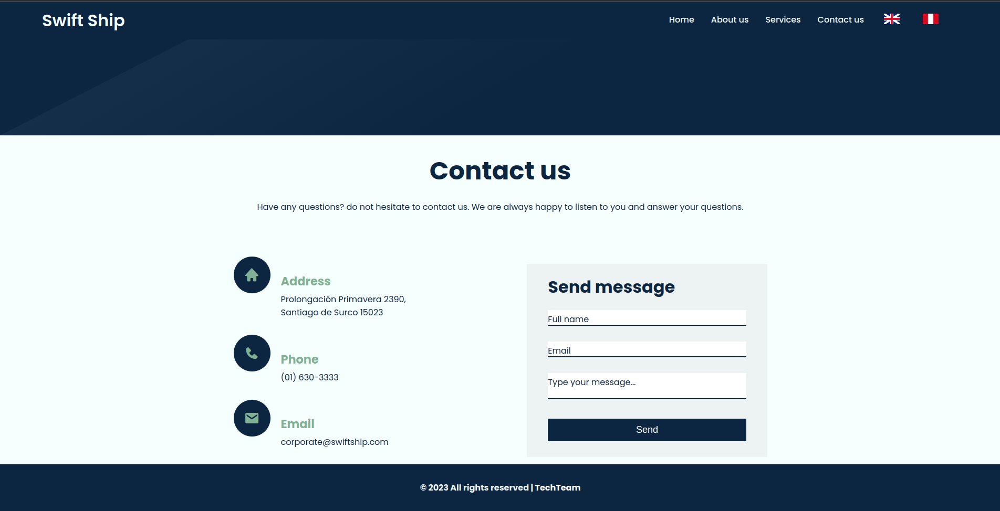
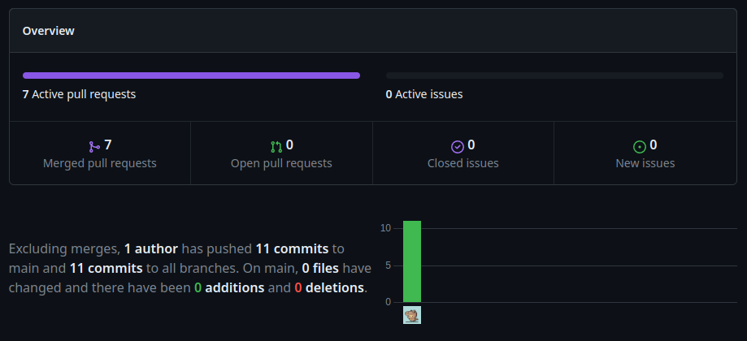
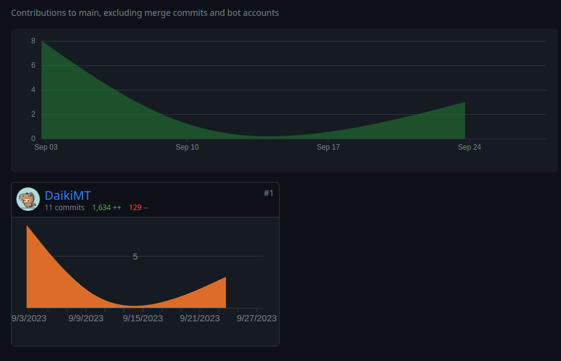
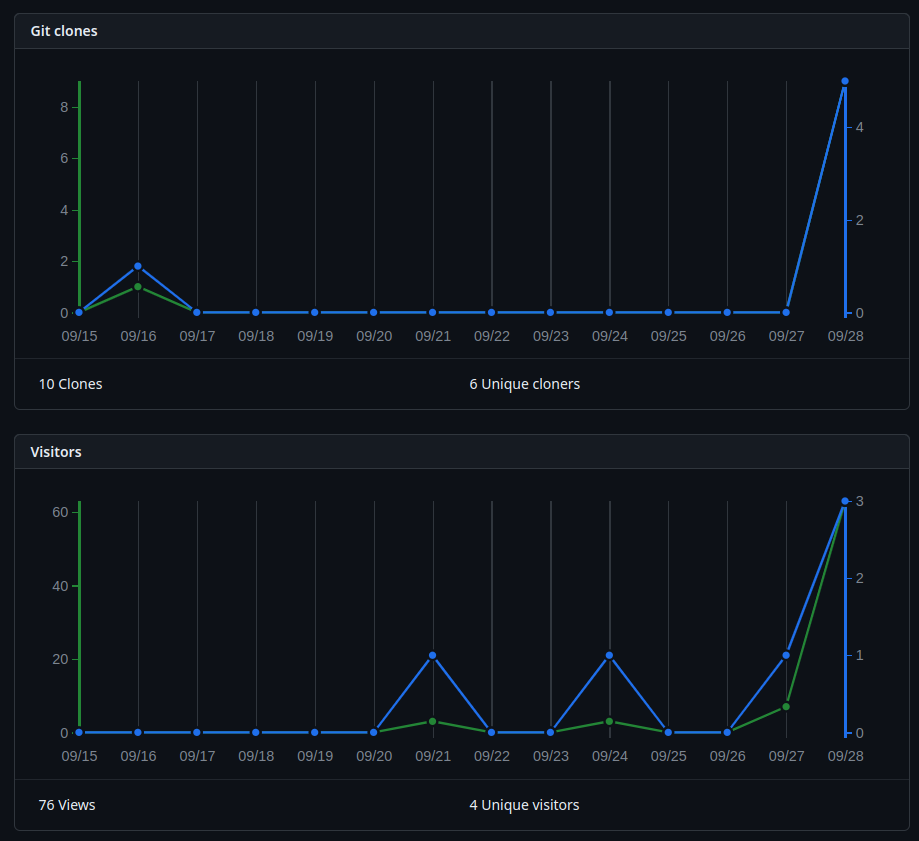
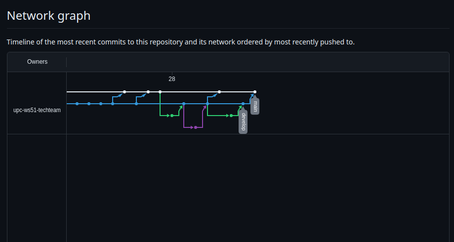

<h3 id="sprint-1">5.2.1. Sprint 1</h3>
<h3 id="sprint-planning-1">5.2.1.1. Sprint Planning 1</h3>
<h3 id="sprint-backlog-1">5.2.1.2. Sprint Backlog 1</h3>

<h3 id="development-evidence-for-sprint-review">5.2.1.3. Development Evidence for Sprint Review</h3>

En esta sección se presentan los avances de implementación con relación a los productos desarrollados en el presente Sprint. La implementación que se desarrollo fue la primera version del Landing Page, se implementaron ramas a partir de la rama develop para que cada integrante pueda codificar su parte del Landing Page, se implementaron la navbar, la sección know us, la sección services, goals, hero and footer. Con ello completamos el primer sprint de implementación.   

<table border="1">
  <tr>
    <th>Repository</th>
    <th>Branch</th>
    <th>Commit Id</th>
    <th>Commit Message</th>
    <th>Commit Message Body</th>
    <th>Committed on (Date)</th>
  </tr>
  <tr>
    <td>Adrian Melgar / Landing-Swift-Ship</td>
    <td>main</td>
    <td>18400df</td>
    <td>project structure</td>
    <td>HTML template with title("Swift Ship Landing Page).</td>
    <td>6/9/23</td>
  </tr>
  <tr>
    <td>Adrian Melgar / Landing-Swift-Ship</td>
    <td>main</td>
    <td>89f5c9d</td>
    <td>Initial commit</td>
    <td>Initial commit: readme text landing page</td>
    <td>7/09/2023</td>
  </tr>
  <tr>
    <td>Adrian Melgar / Landing-Swift-Ship</td>
    <td>feature/structure-index</td>
    <td>fc6e906</td>
    <td>create structure and index.html</td>
    <td>create structure and index.html</td>
    <td>8/09/2023</td>
  </tr>
  <tr>
    <td>Adrian Melgar / Landing-Swift-Ship</td>
    <td>feature/images-implement</td>
    <td>98b7af5</td>
    <td>images</td>
    <td>Implement images for the landing page</td>
    <td>9/09/2023</td>
  </tr>
  <tr>
    <td>Adrian Melgar / Landing-Swift-Ship</td>
    <td>feature/index-html</td>
    <td>3baa605</td>
    <td>Index.html</td>
    <td>add index html</td>
    <td>10/09/2023</td>
  </tr>
  <tr>
    <td>Adrian Melgar / Landing-Swift-Ship</td>
    <td>feature/styles</td>
    <td>9fa14f7</td>
    <td>Styles.css</td>
    <td>add styles and scripts</td>
    <td>11/09/2023</td>
  </tr>
  <tr>
    <td>Adrian Melgar / Landing-Swift-Ship</td>
    <td>bugfix/fix-structure</td>
    <td>d0f1169</td>
    <td>Fix name structure</td>
    <td>fix name assests to -&gt; assets</td>
    <td>12/09/2023</td>
  </tr>
  <tr>
    <td>Adrian Melgar / Landing-Swift-Ship</td>
    <td>feature/internationalization</td>
    <td>7396c65</td>
    <td>Added internationalization</td>
    <td>Added buttons to change the language -&gt; assets</td>
    <td>13/09/2023</td>
  </tr>
</table>

<h3 id="testing-suite-rvidence-for-sprint-review">5.2.1.4. Testing Suite Evidence for Sprint Review</h3>

Para la entrega del Sprint 1, solo se desarrollaron los features relacionados con el sitio
web estatico, no se realiz6 la implementacion de los Web Services.

<h3 id="software-deployment-evidence-for-sprint-review">5.2.1.5. Execution Evidence for Sprint Review</h3>

Al finalizar el Sprint 1, se lograron implementar todas las secciones de nuestro Landing Page para su visualización óptima y se le dio un formato atractivo que captura la atención del usuario en los diferentes elementos que lo componen. Además, se agregaron métodos de navegación en la página, como los botones ubicados en la parte superior e inferior, que permiten saltar de una sección a otra. A continuación, se presentarán los avances mediante imágenes del resultado obtenido.

Es importante destacar que la función principal del Landing Page es convertir a los visitantes en futuros clientes o usuarios frecuentes de nuestro servicio, para lo cual utilizamos llamados a la acción (Call To Action) que les permiten acceder a la aplicación web.

A continuación, se muestran capturas de pantalla del desarrollo del Landing Page:

   
    
   
    
   
    
   
    
   
    

<h3 id="services-documentation-evidence-for-sprint-review">5.2.1.6. Services Documentation Evidence for Sprint Review</h3>

Durante el Sprint 1, hemos diseñado, codificado y desplegado la Landing Page para presentar la aplicación web "Swift Ship". En esta Landing Page, encontrarás varias secciones desarrolladas por el equipo "TechTeam", con contribuciones de cada uno de los miembros del grupo.

|                           Endpoint                           |                  Funciones                  |
| :----------------------------------------------------------: | :-----------------------------------------: |
| https://upc-ws51-techteam.github.io/swift-ship-landing-page/ | Despliegue de la lanfing page de Swift Ship |

<h3 id="software-deployment-evidence-for-sprint-review">5.2.1.7. Software Deployment Evidence for Sprint Review</h3>

Para el despliegue de nuestra página, hemos utilizado GitHub Pages. Para lograrlo, creamos un repositorio en GitHub, donde gestionamos el control de versiones. En la sección de Configuración, publicamos el proyecto que estaba almacenado en la rama "release".

Puedes acceder a la landing page desplegada en el siguiente enlace: https://upc-ws51-techteam.github.io/swift-ship-landing-page/.

<h3 id="team-collaboration-insights-during-sprint">5.2.1.8. Team Collaboration Insights during Sprint</h3>

Para esta entrega, nuestro objetivo fue desplegar el Landing Page. Para lograrlo, hemos utilizado las siguientes herramientas: GitHub, Visual Studio Code, HTML, CSS y JavaScript. A continuación, presentaremos los diagramas de flujo de los commits realizados por cada miembro del grupo TechTeam:

  

  

  

  
